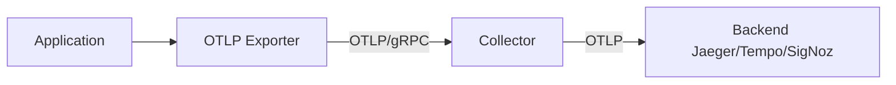
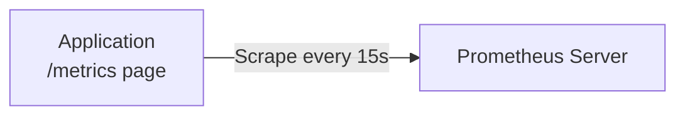
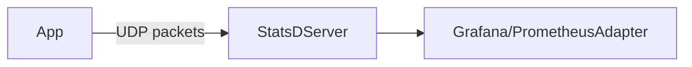
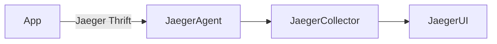
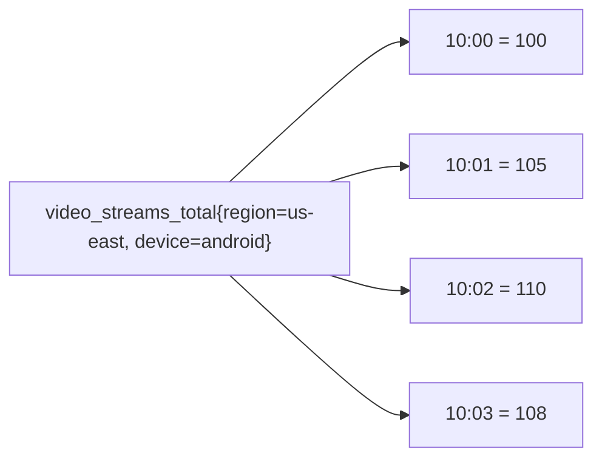

# Observability Systems - Complete Picture

## Observability Fundamentals
### Understanding the Three Pillars of the Observability

The three pillars of observability are Metrics, Logs, and Traces. They help you understand what is happening inside a system from different angles.

## What is each Pillar?
**Metrics** are numerical units that represent the state and performance of your system at a specific point in time. Metrics are quantitative, aggregated data points collected at regular intervals, which can be used for monitoring trends and setting alerts.

**Logs** are timestamped, immutable records of every event that happened within the system. These logs capture what happened and when it happened, that contains "who, what, where, when and how" of the system operations.

**Traces** represent the journey of a single request as it passes through various components of the distributed system. Traces let you know the whole path of execution , relationships between different services and how the components are interacting with each other.


## Metrics
### What data do metrics contain?
It contains metric name, timestamp, numeric value, and optional labels (also called tags or dimensions). The metric name and labels can identify the time series uniquely.

Metric consists of name, labels(key-value pairs), a value(a floating-point number), and a timestamp(Unix time)
```
http_requests_total{method="GET", status="200", service="api"} 1230 @1638364720
```
This represents 1230 total HTTP requests at the given timestamp with all the specific characteristics.

### Types of Metrics : 
There are four key metric types, and each solves a different problem.

#### 1. Counters
Counters are cumulative metrics that only increase (or resets to zero) and never go down. Counters track totals over time.

- Use cases: Total number of requests processed, Total errors encountered, Total bytes sent/received

```
http_requests_total{method="POST", endpoint="/api/users"} 5284
page_views_total{page="/home"} 128456
```
Trade-offs : Counters provide absolute totals but require rate calculations to understand velocity. 


#### 2. Gauges
Gauges represent values that can go up or down. They measure the current state at a specific moment

Use cases: Current memory usage, Active connection count, Queue length, Temperature readings

```
memory_usage_bytes{instance="server-01"} 4294967296
active_connections{service="database"} 47
cpu_temperature_celsius{core="0"} 65.3
```
Trade-offs : Gauges provide instant snapshots that can have rapid changes between the scrapes. For high-frequency changes, we use histograms.

#### 3. Histograms
Histograms group values into predefined buckets and count them. They track the frequency of values across predefined ranges.

Structure: A histogram exposes three time series:
-  <metric_name>_bucket{le="<upper_bound>"} - cumulative counters for each bucket
-  <metric_name>_sum - total sum of all observations
-  <metric_name>_count - total count of observations

Example : 
```
http_request_duration_seconds_bucket{le="0.1"} 5234
http_request_duration_seconds_bucket{le="0.5"} 8956
http_request_duration_seconds_bucket{le="1.0"} 9823
http_request_duration_seconds_bucket{le="+Inf"} 10000
http_request_duration_seconds_sum 4567.89
http_request_duration_seconds_count 10000
```
This means 5234 requests finished under 0.1s, 8956 requests finished under 0.5s, etc

Use cases: Request duration/ latency, Response sizes, Processing times

Trade-offs :
- Efficient for aggregation across dimensions
- can calculate quantiles on server-side using histogram_quantile
- Fixed bucket boundaries so we have to choose it wisely
- Less accurate than summaries

#### 4. Summaries 
Summaries look similar to histograms, but their job is different, they compute precise percentiles on the client side and show them directly

- <metric_name>{quantile="<φ>"} - pre-calculated quantile values
- <metric_name>_sum - total sum of observations
- <metric_name>_count - total count of observations

```
http_request_duration_seconds{quantile="0.5"} 0.12
http_request_duration_seconds{quantile="0.9"} 0.45
http_request_duration_seconds{quantile="0.99"} 1.23
http_request_duration_seconds_sum 3456.78
http_request_duration_seconds_count 8000
```
Use cases: 
- Precise quantile calculations when you know exact percentiles needed
- When value distribution is unpredictable

Trade-offs: 
- Accurate quantiles are calculated on exact percentiles
- No need to configure buckets
- Higher computational cost on client

### When to use Each Metric Type
- Counters : totals
- Gauges : real-time values
- Histograms : distribution + aggregation
- Summaries : precise percentiles, no aggregation


## Logs
### Structured and Unstructured Logs
**Unstructured Logs are plain text messages :
Example
```
2023-10-15 14:32:11 ERROR Payment processing failed for user john_doe on order #12345
```

Disadvantages : Requires complex Regex to process it,  difficult to query specific fields

**Structure Log (JSON)**
written in structured format;
Example: 
```
{
  "timestamp": "2023-10-15T14:32:11.234Z",
  "level": "ERROR",
  "service": "payment-api",
  "message": "Payment processing failed",
  "user_id": "john_doe",
  "order_id": "12345",
  "trace_id": "abc-xyz-123",
  "error_code": "PAYMENT_DECLINED",
  "amount": 99.99,
  "currency": "USD"
}

```
Advantages: Overcomes the Unstructured format cons, Supports advanced analytics and aggregation and also we easily integrate the log management tools

Use cases : Debugging, Audit records, Investigating errors and requests.

Trade-offs: 
- Highly detailed
- Unstructured logs are hard to query
- Structured logs support analytics
- No automatic aggregation

## Traces
### Traces: spans, trace context, baggage
**Span** represents a single unit of work in distributed system. 
It contains:
- Trace ID - unique Id for whole request journey
- Span ID - unique Id for specific operation
- Parent Span ID - Links child to the parent span
- Operation name - what this span does
- Start time and duration
- Attributes - Key-value pairs
- Events - Timestamped annotations within the span
- Status - Success, error, or unset

Example: 
```
{
  "traceId": "4bf92f3577b34da6a3ce929d0e0e4736",
  "spanId": "00f067aa0ba902b7",
  "parentSpanId": "fb1a3d1e4f5b6c7d",
  "name": "POST /api/orders",
  "kind": "SERVER",
  "startTime": "2024-11-18T22:18:00.123Z",
  "endTime": "2024-11-18T22:18:00.456Z",
  "attributes": {
    "http.method": "POST",
    "http.url": "/api/orders",
    "http.status_code": 201,
    "user.id": "12345"
  },
  "events": [
    {
      "timestamp": "2024-11-18T22:18:00.234Z",
      "name": "validation_completed"
    }
  ],
  "status": {
    "code": "OK"
  }
}
```

A trace is complete journey, with collection of all related spans making a directed acyclic graph (DAG)

#### Trace Context and Propagation
**Trace Context** is the metadata that travels along the request across service boundaries. It includes:
1. Trace ID 
2. Span ID 
3. Trace Flags
4. Trace State

**Context Propagation** ensures spans are correctly correlated across distributed services. 

**Traceparent** 
when one service calls another, it sends a tiny information as tag so that the next service knows which request it belong to, which operation is it and also flag to record this in trace or not.

-I understand it is like a courier tracking number printed on the every package so that all delivery centers know that it is a part of shipment 

**Tracestate** is like extra information used by vendors (Jaeger, DataDog, etc) to help them process the trace.

```
traceparent: 00-4bf92f3577b34da6a3ce929d0e0e4736-00f067aa0ba902b7-01
tracestate: vendor1=value1,vendor2=value2
```

#### Baggage
**Baggage** is small extra information that travels with the request across all services. 
- It is like a sticky note attached to a file 
- we use this baggage when multiple services need to know small information like which tenant, user, feature flag is on, experiment is running.

Example : 
Service A:
```
baggage.set("tenant.id", "acme-corp");
```
Service B,C,D :
```
baggage.get("tenant.id");// returns "acme-corp"
```
now all the other services will know which company i.e., acme-corp that the request belong to without passing it manually

- We should be careful while using baggage because it might increase the header size and also it is sending in header we should never put passwords or sensitive information in it.

### When do we use Traces?
**Traces** are used when you want to understand how a request moves through multiple services.
- It is like timeline + map for a single user request

By using Traces we can find:
- Why is this request slow?
- Which service caused the error?
- How do our services depend on each other?
- Where is time being spent end-to-end?

Real-Life example: 
when an user clicks "Buy Now":
1. Request goes to frontend 
2. Then to cart service
3. Then to payment service
4. Then to database
5. Then back

A trace shows all the steps, how long each one took, and which one failed.


### How the three pillars work together
Suppose if our system breaks at a time then,
1. Metrices tells you something is wrong like Error rate for something spikes 
    - it is like Warning lights in the car 
2. Traces help you zoom in the issue
    - then we check traces at the time to find the slow or failed requests
3. Logs give exact details 
    - we take trace ID and search logs and see what is the issue    

## 1. OTLP (OpenTelemetry Protocol)
It is official language used by OpenTelemetry to send metrics, logs, and traces from app to any backend (Jaeger, Tempo, SigNoz, Honeycomb, etc).
- OTLP transports traces, metrics, logs, baggage/context
- Supported transports : 
    - gRPC (binary,fast)
    - HTTP (JSON or Protobuf)

Example (OTLP over HTTP JSON)
```
{
  "resourceLogs": [
    {
      "resource": { "service.name": "checkout-service" },
      "scopeLogs": [
        {
          "logRecords": [
            {
              "severityText": "ERROR",
              "body": { "stringValue": "payment failed" }
            }
          ]
        }
      ]
    }
  ]
}
```



## 2. Prometheus Exposition Format
Application exposes metrics on a HTTP endpoint(/metrics)
Prometheus pulls (scrapes) this page every few seconds.
- it is like our application put numbers on a public notice board, and Prometheus walks by and reads it regulary.

Example (/metrics output)
```
http_requests_total{method="GET"} 1203
cpu_usage 78.5
```


## 3. StatsD
- It is a lightweight way to send metrics using UDP.
- It is like telling the metrics and on other side StatsD server notes it down.
Example :
```
login.success:1|c
page.load_time:250|ms
```


## 4. Syslog 
Old but reliable protocol to send logs to a central log server.
- it is like a shared mailbox where every server drops its log messages.

Example Syslog line:
```
<34>1 2024-01-01T12:00:00Z nginx INFO "User logged in"
```

Used in OS logs, Network devices, Firewalls, Traditional servers
 ```mermaid
flowchart LR
Server1 -->|Syslog| Collector
Server2 -->|Syslog| Collector
Collector --> LogStorage
```

## 5. Jaeger Thrift
Jaeger's older protocol for sending trace spans using Apache Thrift.
Now OTLP become the standard before that Jaeger had it own language for sending trace data.

- still it is used in older Jaeger deployments, Legacy microservices, some libraries still export it



## Cardinality 
Means how many unique time-series your system is generating.
Example:
```
http_requests_total{method="GET", status="200", user_id="123"}
```

suppose if we have 5 methods, 10 status codes, 10,00,000 user_ids.
- then possible sereis =  5 * 10 * 1000000 = 50 million , high cardinality

- Observability systems store time-series, so it need more cpu to scrape, more memory for caching, and also higher cost

- causes Cardinality Explosion like when using high-cardinality labels, too manhy combinations, using histograms with many buckets.


## Time-series Nature of Observability Data
A time-series is a value recording something again and again over time.
for example:
```
http_requests_total{method="GET", status="200"}
```
- this is one time-series,
Another time-series :
```
http_requests_total{method="POST", status="200"}   <-- NEW series
http_requests_total{method="GET", status="500"}    <-- NEW series
```
so if our application has :
- GET + POST
- 200 + 400 + 500
then we have 6 time-series( 2 methods * 3 status codes)

```lua
time →
|-----|-----|-----|-----|-----|
  1     2     3     4     5

cpu_usage{host="a"}:  45, 50, 55, 48, 47
cpu_usage{host="b"}:  30, 32, 29, 31, 28
```
Each row = its own time-series

### Real-world example
Suppose Netflix has this metrix:
```
video_streams_total{region="us-east", device="android"}
```
then Prometheus will store like this:


Every timestamp creates a new datapoint in the same series.
### References :
1. https://victoriametrics.com/blog/prometheus-monitoring-metrics-counters-gauges-histogram-summaries/
2. https://prometheus.io/docs/concepts/metric_types/
3. https://signoz.io/guides/what-are-the-4-types-of-metrics-in-prometheus/


