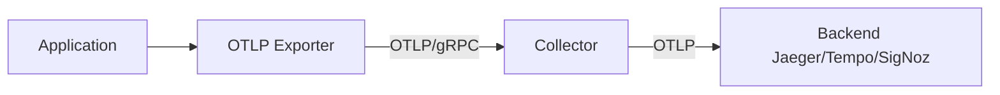
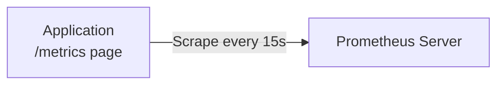
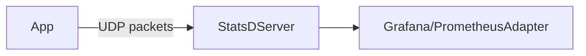
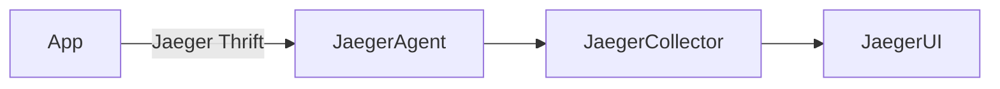
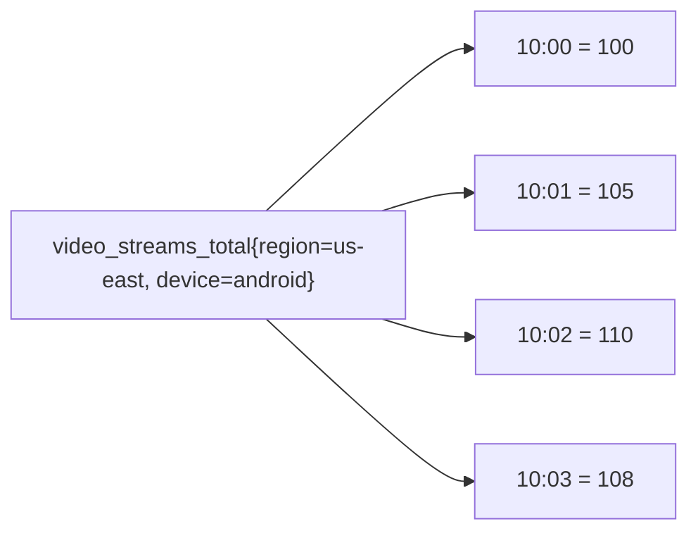
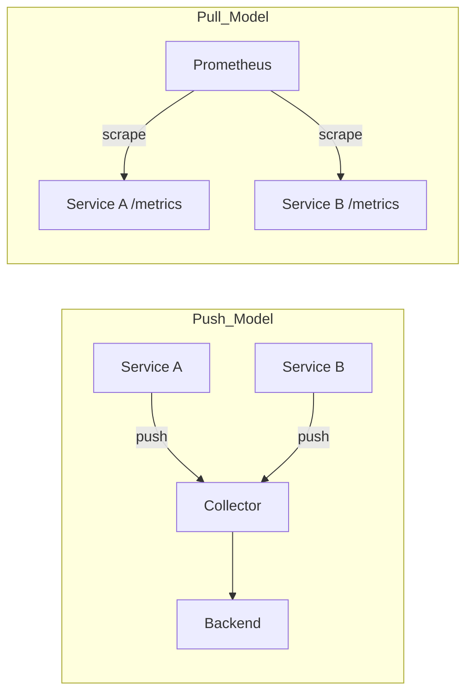
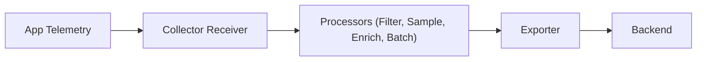
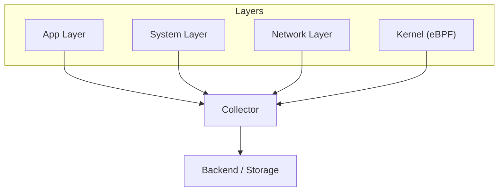
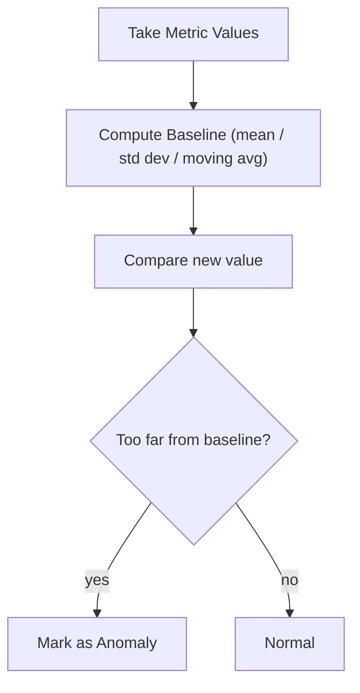
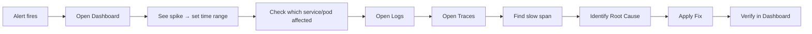

# Observability Systems - Complete Picture

## Observability Fundamentals
### Understanding the Three Pillars of the Observability

The three pillars of observability are Metrics, Logs, and Traces. They help you understand what is happening inside a system from different angles.

## What is each Pillar?
**Metrics** are numerical units that represent the state and performance of your system at a specific point in time. Metrics are quantitative, aggregated data points collected at regular intervals, which can be used for monitoring trends and setting alerts.

**Logs** are timestamped, immutable records of every event that happened within the system. These logs capture what happened and when it happened, that contains "who, what, where, when and how" of the system operations.

**Traces** represent the journey of a single request as it passes through various components of the distributed system. Traces let you know the whole path of execution , relationships between different services and how the components are interacting with each other.


## Metrics
### What data do metrics contain?
It contains metric name, timestamp, numeric value, and optional labels (also called tags or dimensions). The metric name and labels can identify the time series uniquely.

Metric consists of name, labels(key-value pairs), a value(a floating-point number), and a timestamp(Unix time)
```
http_requests_total{method="GET", status="200", service="api"} 1230 @1638364720
```
This represents 1230 total HTTP requests at the given timestamp with all the specific characteristics.

### Types of Metrics : 
There are four key metric types, and each solves a different problem.

#### 1. Counters
Counters are cumulative metrics that only increase (or resets to zero) and never go down. Counters track totals over time.

- Use cases: Total number of requests processed, Total errors encountered, Total bytes sent/received

```
http_requests_total{method="POST", endpoint="/api/users"} 5284
page_views_total{page="/home"} 128456
```
Trade-offs : Counters provide absolute totals but require rate calculations to understand velocity. 


#### 2. Gauges
Gauges represent values that can go up or down. They measure the current state at a specific moment

Use cases: Current memory usage, Active connection count, Queue length, Temperature readings

```
memory_usage_bytes{instance="server-01"} 4294967296
active_connections{service="database"} 47
cpu_temperature_celsius{core="0"} 65.3
```
Trade-offs : Gauges provide instant snapshots that can have rapid changes between the scrapes. For high-frequency changes, we use histograms.

#### 3. Histograms
Histograms group values into predefined buckets and count them. They track the frequency of values across predefined ranges.

Structure: A histogram exposes three time series:
-  <metric_name>_bucket{le="<upper_bound>"} - cumulative counters for each bucket
-  <metric_name>_sum - total sum of all observations
-  <metric_name>_count - total count of observations

Example : 
```
http_request_duration_seconds_bucket{le="0.1"} 5234
http_request_duration_seconds_bucket{le="0.5"} 8956
http_request_duration_seconds_bucket{le="1.0"} 9823
http_request_duration_seconds_bucket{le="+Inf"} 10000
http_request_duration_seconds_sum 4567.89
http_request_duration_seconds_count 10000
```
This means 5234 requests finished under 0.1s, 8956 requests finished under 0.5s, etc

Use cases: Request duration/ latency, Response sizes, Processing times

Trade-offs :
- Efficient for aggregation across dimensions
- can calculate quantiles on server-side using histogram_quantile
- Fixed bucket boundaries so we have to choose it wisely
- Less accurate than summaries

#### 4. Summaries 
Summaries look similar to histograms, but their job is different, they compute precise percentiles on the client side and show them directly

- <metric_name>{quantile="<φ>"} - pre-calculated quantile values
- <metric_name>_sum - total sum of observations
- <metric_name>_count - total count of observations

```
http_request_duration_seconds{quantile="0.5"} 0.12
http_request_duration_seconds{quantile="0.9"} 0.45
http_request_duration_seconds{quantile="0.99"} 1.23
http_request_duration_seconds_sum 3456.78
http_request_duration_seconds_count 8000
```
Use cases: 
- Precise quantile calculations when you know exact percentiles needed
- When value distribution is unpredictable

Trade-offs: 
- Accurate quantiles are calculated on exact percentiles
- No need to configure buckets
- Higher computational cost on client

### When to use Each Metric Type
- Counters : totals
- Gauges : real-time values
- Histograms : distribution + aggregation
- Summaries : precise percentiles, no aggregation


## Logs
### Structured and Unstructured Logs
**Unstructured Logs are plain text messages :
Example
```
2023-10-15 14:32:11 ERROR Payment processing failed for user john_doe on order #12345
```

Disadvantages : Requires complex Regex to process it,  difficult to query specific fields

**Structure Log (JSON)**
written in structured format;
Example: 
```
{
  "timestamp": "2023-10-15T14:32:11.234Z",
  "level": "ERROR",
  "service": "payment-api",
  "message": "Payment processing failed",
  "user_id": "john_doe",
  "order_id": "12345",
  "trace_id": "abc-xyz-123",
  "error_code": "PAYMENT_DECLINED",
  "amount": 99.99,
  "currency": "USD"
}

```
Advantages: Overcomes the Unstructured format cons, Supports advanced analytics and aggregation and also we easily integrate the log management tools

Use cases : Debugging, Audit records, Investigating errors and requests.

Trade-offs: 
- Highly detailed
- Unstructured logs are hard to query
- Structured logs support analytics
- No automatic aggregation

## Traces
### Traces: spans, trace context, baggage
**Span** represents a single unit of work in distributed system. 
It contains:
- Trace ID - unique Id for whole request journey
- Span ID - unique Id for specific operation
- Parent Span ID - Links child to the parent span
- Operation name - what this span does
- Start time and duration
- Attributes - Key-value pairs
- Events - Timestamped annotations within the span
- Status - Success, error, or unset

Example: 
```
{
  "traceId": "4bf92f3577b34da6a3ce929d0e0e4736",
  "spanId": "00f067aa0ba902b7",
  "parentSpanId": "fb1a3d1e4f5b6c7d",
  "name": "POST /api/orders",
  "kind": "SERVER",
  "startTime": "2024-11-18T22:18:00.123Z",
  "endTime": "2024-11-18T22:18:00.456Z",
  "attributes": {
    "http.method": "POST",
    "http.url": "/api/orders",
    "http.status_code": 201,
    "user.id": "12345"
  },
  "events": [
    {
      "timestamp": "2024-11-18T22:18:00.234Z",
      "name": "validation_completed"
    }
  ],
  "status": {
    "code": "OK"
  }
}
```

A trace is complete journey, with collection of all related spans making a directed acyclic graph (DAG)

#### Trace Context and Propagation
**Trace Context** is the metadata that travels along the request across service boundaries. It includes:
1. Trace ID 
2. Span ID 
3. Trace Flags
4. Trace State

**Context Propagation** ensures spans are correctly correlated across distributed services. 

**Traceparent** 
when one service calls another, it sends a tiny information as tag so that the next service knows which request it belong to, which operation is it and also flag to record this in trace or not.

-I understand it is like a courier tracking number printed on the every package so that all delivery centers know that it is a part of shipment 

**Tracestate** is like extra information used by vendors (Jaeger, DataDog, etc) to help them process the trace.

```
traceparent: 00-4bf92f3577b34da6a3ce929d0e0e4736-00f067aa0ba902b7-01
tracestate: vendor1=value1,vendor2=value2
```

#### Baggage
**Baggage** is small extra information that travels with the request across all services. 
- It is like a sticky note attached to a file 
- we use this baggage when multiple services need to know small information like which tenant, user, feature flag is on, experiment is running.

Example : 
Service A:
```
baggage.set("tenant.id", "acme-corp");
```
Service B,C,D :
```
baggage.get("tenant.id");// returns "acme-corp"
```
now all the other services will know which company i.e., acme-corp that the request belong to without passing it manually

- We should be careful while using baggage because it might increase the header size and also it is sending in header we should never put passwords or sensitive information in it.

### When do we use Traces?
**Traces** are used when you want to understand how a request moves through multiple services.
- It is like timeline + map for a single user request

By using Traces we can find:
- Why is this request slow?
- Which service caused the error?
- How do our services depend on each other?
- Where is time being spent end-to-end?

Real-Life example: 
when an user clicks "Buy Now":
1. Request goes to frontend 
2. Then to cart service
3. Then to payment service
4. Then to database
5. Then back

A trace shows all the steps, how long each one took, and which one failed.


### How the three pillars work together
Suppose if our system breaks at a time then,
1. Metrices tells you something is wrong like Error rate for something spikes 
    - it is like Warning lights in the car 
2. Traces help you zoom in the issue
    - then we check traces at the time to find the slow or failed requests
3. Logs give exact details 
    - we take trace ID and search logs and see what is the issue    

## 1. OTLP (OpenTelemetry Protocol)
It is official language used by OpenTelemetry to send metrics, logs, and traces from app to any backend (Jaeger, Tempo, SigNoz, Honeycomb, etc).
- OTLP transports traces, metrics, logs, baggage/context
- Supported transports : 
    - gRPC (binary,fast)
    - HTTP (JSON or Protobuf)

Example (OTLP over HTTP JSON)
```
{
  "resourceLogs": [
    {
      "resource": { "service.name": "checkout-service" },
      "scopeLogs": [
        {
          "logRecords": [
            {
              "severityText": "ERROR",
              "body": { "stringValue": "payment failed" }
            }
          ]
        }
      ]
    }
  ]
}
```



## 2. Prometheus Exposition Format
Application exposes metrics on a HTTP endpoint(/metrics)
Prometheus pulls (scrapes) this page every few seconds.
- it is like our application put numbers on a public notice board, and Prometheus walks by and reads it regulary.

Example (/metrics output)
```
http_requests_total{method="GET"} 1203
cpu_usage 78.5
```


## 3. StatsD
- It is a lightweight way to send metrics using UDP.
- It is like telling the metrics and on other side StatsD server notes it down.
Example :
```
login.success:1|c
page.load_time:250|ms
```


## 4. Syslog 
Old but reliable protocol to send logs to a central log server.
- it is like a shared mailbox where every server drops its log messages.

Example Syslog line:
```
<34>1 2024-01-01T12:00:00Z nginx INFO "User logged in"
```

Used in OS logs, Network devices, Firewalls, Traditional servers
 ```mermaid
flowchart LR
Server1 -->|Syslog| Collector
Server2 -->|Syslog| Collector
Collector --> LogStorage
```

## 5. Jaeger Thrift
Jaeger's older protocol for sending trace spans using Apache Thrift.
Now OTLP become the standard before that Jaeger had it own language for sending trace data.

- still it is used in older Jaeger deployments, Legacy microservices, some libraries still export it



## Cardinality 
Means how many unique time-series your system is generating.
Example:
```
http_requests_total{method="GET", status="200", user_id="123"}
```

suppose if we have 5 methods, 10 status codes, 10,00,000 user_ids.
- then possible sereis =  5 * 10 * 1000000 = 50 million , high cardinality

- Observability systems store time-series, so it need more cpu to scrape, more memory for caching, and also higher cost

- causes Cardinality Explosion like when using high-cardinality labels, too manhy combinations, using histograms with many buckets.


## Time-series Nature of Observability Data
A time-series is a value recording something again and again over time.
for example:
```
http_requests_total{method="GET", status="200"}
```
- this is one time-series,
Another time-series :
```
http_requests_total{method="POST", status="200"}   <-- NEW series
http_requests_total{method="GET", status="500"}    <-- NEW series
```
so if our application has :
- GET + POST
- 200 + 400 + 500
then we have 6 time-series( 2 methods * 3 status codes)

```lua
time →
|-----|-----|-----|-----|-----|
  1     2     3     4     5

cpu_usage{host="a"}:  45, 50, 55, 48, 47
cpu_usage{host="b"}:  30, 32, 29, 31, 28
```
Each row = its own time-series

### Real-world example
Suppose Netflix has this metrix:
```
video_streams_total{region="us-east", device="android"}
```
then Prometheus will store like this:


Every timestamp creates a new datapoint in the same series.
### References :
1. https://victoriametrics.com/blog/prometheus-monitoring-metrics-counters-gauges-histogram-summaries/
2. https://prometheus.io/docs/concepts/metric_types/
3. https://signoz.io/guides/what-are-the-4-types-of-metrics-in-prometheus/

---

# Data Collection Architecture
## What is a collector? Why do we need it instead of directly sending to backend?
Collector is a small service between the our application and our observability backend.
- It receives telemetry (metrics, logs, traces), processes it, and forwards it safely.

There are various reasons not to send data directly:
  1. If there are too many connections then backend will have overload. Collector solves this like a buffer
  2. Applications use different protocols like OTLP, StatsD, Prometheus but backend expect only one. Collector converts that to standard format that backend understands
  3. we need to process/clean/filter data. Collector can drop spam logs, reduce cardinality, sample traces, batch + compress. Our app should not do this work, let the collector solve this.
  4. If backend is down and apps send data directly to backend then the data gets lost. Collector buffers and retries so no loss.
  5. We might want to send data to multiple destinations then apps don't need to know where data goes. Collector can handle this.

Example: 
  ```mermaid
  flowchart LR
A1[Service A] --> B[Collector]
A2[Service B] --> B
A3[Service C] --> B
B -->|Traces| T[Tempo]
B -->|Metrics| P[Prometheus]
B -->|Logs| L[Loki]
```

## Collection Models
There are three main ways data :

### 1. Agent-based Collection
- By installing a lightweight agent on each host/server/pod
Example : Datadog Agent, OpenTelemetry Collector as Agent, New Relic Infrastructure Agent.

- the agent will scrapes metrics, collect logs, capture traces, send everything to central collector or backend

- **Advantages** : no need to modify applications, Handles retries and buffering, Auto-discovers workloads

- **Disavantages**: Uses some CPU/RAM

- we use this when we want full visibility with minimal app changes

### 2. Agentless Collection
- no agent to be installed , does the remote scraping
Examples: Prometheus scraping / metrics, CloudWatch using API polling, SNMP polling, Syslog forwarding

Advantages : No agents on servers, Easy to enable, Less resource usage on hosts

Disadvantages : can miss data during network failures, Harder to scale, cannot collect deep system data, needs firewall openings

- used where installing agents is restrictred

### 3. eBPF-based collection
- runs inside Linux Kernel
- collects data directly from the kernal without modifying apps
- it can see things like network calls, syscall latency, container events, DNS queries, tcp latency etc…
- basically it runs at very low level so it captures data even if the application does not expose anything

Advantages: 
- zero code changes needed
- low overhead (its in kernel so very fast)
- captures deep insights (network, syscalls etc)
- good for microservices and debugging tricky latency issues

Disadvantages:
- works only on Linux
- requires newer kernel
- bit complex to debug
- some security restrictions

when to use:
- when we need deep visibility without touching the app
- when we want auto tracing or network-level data
- when agent cannot capture low-level info

## Push vs Pull Models

### Push model

- app or agent **pushes** data to collector/backend  
- Examples: **OTLP**, **StatsD**, **Jaeger**, **FluentBit** etc  
- good for **logs and traces**  
- realtime  
- works behind firewalls  
- easy to configure in distributed systems  

Advantages:
- no scrape load  
- low overhead  
- doesn’t require exposing endpoints  

Disadvantages:
- hard to detect failures (if pipeline breaks maybe data lost)  
- backend can get overloaded if too many pushers  

**used when:** logs, traces, OTLP exporters, cloud env etc.

---

### Pull model

- backend **pulls** data from services  
- Example: **Prometheus scraping /metrics** endpoint  
- good for **metrics**  
- easy to detect failure (scrape fails → you know)  
- more stable because backend controls the scraping rate  

Advantages: 
- safe and predictable  
- backend handles load  
- no need complex configs in apps  

Disadvantages:
- not good for logs/traces  
- requires endpoints to be exposed  
- harder in firewall-restricted networks  

**used when:**  
- collecting metrics  
- Prometheus + Kubernetes setups  



## What processing happens at collection point?

At the collector side, a lot of processing happens so that the backend does not get overloaded and also the data becomes more useful. Basically the collector sits in the middle and cleans + shapes the telemetry before sending it ahead.

---

### 1. Filtering unwanted data
- collector can drop logs or metrics which are not needed  
- like dropping debug logs in production, remove noisy metrics, remove some high-cardinality labels  
- helps reduce storage cost + backend load  
- makes the dashboards cleaner because only important data goes in  

Example:  
- drop all logs with `level=debug`  
- drop metrics with unbounded or random labels  

---

### 2. Sampling strategies
Sampling is mainly for **traces** because capturing every trace is too costly. There are different types:

#### head-based sampling
- decision made at the beginning of the trace  
- like “sample 1% upfront”  
- cheap and simple  

#### tail-based sampling
- collector waits for full trace  
- then decides based on outcome  
- keeps error traces, slow traces  
- more accurate but heavier  

#### probabilistic sampling
- random sampling like “take 0.1%”  
- predictable + easy  

Collectors use these strategies so backend doesn’t drown in too many traces.

---

### 3. Buffering and batching
- collector batches telemetry instead of sending 1 by 1  
- batching reduces network overhead  
- buffering stores data temporarily when backend is slow or down  
- avoids data loss  
- works like a small queue + optimiser  

---

### 4. Metadata enrichment
- collector adds extra useful information  
- like service name, region, cluster ID, pod name, environment, version  
- helps in filtering, dashboards, grouping  
- no need to modify app code for this  

Example metadata added:
```
service.name = checkout
env = production
region = us-east
k8s.pod = checkout-123
```

---

### 5. Protocol translation
- apps send data in different formats  
- collector converts everything into a common format that backend understands  

Examples:
- StatsD → OTLP  
- Jaeger Thrift → OTLP  
- Syslog → Loki
- JSON logs → structured logs  
- Prometheus → remote write  

This makes apps simpler because they don’t need to implement multiple protocols.

---

### processing flow


---

## Collection at different layers

collection can happen at different places in the system. each layer gives different kind of data. some are high level, some are low level. all of them finally go to collector and then backend.

layers:
- application layer (code instrumentation)
- system layer (host metrics, system logs)
- network layer (packet stuff)
- kernel layer (ebpf)

---

### application layer
- this is inside our app code
- we add metrics, logs, traces using sdk or auto-instrumentation
- collects things like request count, latency, errors, spans etc

**how data moves**
app code -> exporter/agent -> collector -> backend

**why process**
- add metadata (service name, version etc)
- sample traces if too many
- remove sensitive fields from logs
- convert to otlp or whatever

**performance**
- instrumentation uses cpu
- histograms cost a bit more
- if exporter blocks, app becomes slow (so need async)

---

### system layer
- collects machine level stuff like cpu, memory, disk, node logs
- node exporter or agent running on host
- syslog/journald logs also come from here

**data flow**
node agent -> collector -> backend

**why process**
- add k8s labels (pod, namespace)
- remove useless system logs
- normalize names

**performance**
- agent uses little cpu/ram
- too many hosts = more scrape load
- scraping every few seconds uses network and cpu

---

### network layer
- collects network flows, tcp latency, dns queries etc
- sometimes packet capture (pcap) but heavy

**data flow**
network tap or tool -> collector -> backend

**why process**
- parse the packets
- aggregate flows
- drop raw packets (too big)
- label source/dest info

**performance**
- packet capture is heavy on cpu
- full packet logs take huge space
- need some sampling here

---

### kernel layer (ebpf)
- runs inside linux kernel
- collects syscall latency, tcp stuff, socket events etc
- doesn’t need app changes

**data flow**
ebpf probe -> ring buffer -> local agent -> collector -> backend

**why process**
- raw kernel events are messy
- need to convert to metrics/traces
- need filtering because events are too many

**performance**
- ebpf is low overhead normally
- but too many probes = more cpu
- needs newer linux kernel

---

## Auto vs manual instrumentation

### auto instrumentation
- automatically instruments http, db, grpc etc
- no code changes
- very fast to setup

**pros**: quick,covers lot of libs

**cons** : noisy spans, too generic names, may add labels that increase cardinality

**use when**
- want observability quickly

---

### manual instrumentation
- developer writes spans/metrics in code
- good for business logic

pros:
- very accurate
- only what you need
- good for slo/critical flows

cons:
- more effort
- easier to forget some paths

**use when**
- critical flows like payment, checkout etc

---

## diagram (layers → collector → backend)



---

# 3. Backend Pipeline Architecture:
## End-to-end data flow
the whole backend pipeline is basically:

**ingestion → processing → storage → query**

data comes in, gets cleaned, stored, and then we query it.  
simple pipeline but inside lots of things happen.

---

## Ingestion Layer (how data arrives)

- data can arrive using **http**, **grpc**, **tcp**, sometimes thrift also  
- depends on the protocol like OTLP (grpc/http), statsd (udp), logs (tcp/http) etc

**load balancing**
- because tons of telemetry coming, so need load balancer in front  
- otherwise one ingestion node dies  
- they usually use nginx, envoy, or built-in lb

**high availability**
- multiple ingestion nodes running  
- if one goes down others take traffic  
- no single point of failure

**initial validation**
- is the payload valid? json valid? otlp header correct?  
- basic checks so corrupted data doesn’t break pipeline

**routing**
- logs go to log pipeline  
- metrics go to metrics pipeline  
- traces go to trace pipeline  
- some backends have separate ingestion endpoints

---

## Processing Stages (middle)

this is where backend shapes the data before storage.

### parsing + normalization
- logs need parsing (json, syslog, text)  
- metrics need to be converted to internal series format  
- traces need span normalization  
- remove weird fields, rename labels, unify timestamps

### aggregation
- compute rates from counters  
- calculate percentiles (p90 p95 p99)  
- reduce huge raw data into manageable form  
- helps dashboards run faster because less raw data

### rollups for long term
- raw data stored short time (like few days)  
- older data gets downsampled (min, max, avg, count)  
- useful for long-term trends  
- save storage cost

### indexing
- logs indexed by labels, fields, timestamp  
- metrics indexed by label set (series id)  
- traces indexed by service name, span name, trace id  
- without index queries become super slow

### data transformation + enrichment
- add cluster name, region, env, app version, pod name etc  
- also drop unwanted fields  
- sometimes convert log fields to structured fields

---

## Storage Layer

different data needs different storage engine because data nature is different.

### time-series databases
- **Prometheus TSDB**
- **InfluxDB**
- **M3DB**
- **VictoriaMetrics**
- **ClickHouse** (also used for metrics by some systems)

metrics = time-series = write-heavy and compressed well.

### log storage
- **Elasticsearch**
- **Loki**
- **ClickHouse** <br>
logs = huge volume = need search indexing.

### trace storage
- **Jaeger** → cassandra or elasticsearch  
- **Tempo** → object storage like S3/GCS  
traces = big spans but not queried as often.

---

## Why different storage for different data?
- metrics = small numeric samples → good with TSDB  
- logs = text, unstructured → need index + search  
- traces = tree structure, spans → stored in chunks or object store  
- cost difference → object store is cheap for traces  
- performance difference → logs need full text search; metrics need fast math queries

---

## Hot vs Warm vs Cold storage

**hot**
- recent data (like last 1-3 days)  
- stored in fast local disks  
- queries are quick  
- dashboards use this

**warm**
- older but still somewhat active  
- maybe compressed or downsampled  
- slower queries

**cold**
- very old data  
- goes to S3, GCS, cheap disk  
- used rarely  
- maybe only summaries kept

---

## Compression techniques
- delta encoding (store diff between values)  
- run length encoding  
- snappy, zstd, lz4  
- chunking logs and traces then compress chunks  
- this reduces storage cost a lot

---

## Retention policies
- we decide how long to keep data  
- example:
  - metrics raw: 7 days  
  - metrics rollup: 1 year  
  - logs: 3–14 days (depends cost)  
  - traces: sampled only, kept 7–30 days  
- dropping old data automatically

---

## Query Layer

### query languages
- **PromQL** (metrics)  
- **LogQL** (loki logs)  
- **TraceQL** (tempo traces)  
- **SQL** (clickhouse, elastic, etc)

### how queries are optimized
- indexes help jump to right data  
- chunks and partitions reduce scanning  
- caching of recent results  
- pre-aggregated metrics make queries faster  
- vectorized execution in column stores

### aggregation at query time vs storage time (trade-offs)

**at storage time (precompute)**
- faster queries  
- less compute needed later  
- but less flexibility  
- wrong aggregation = you lose raw data

**at query time**
- very flexible  
- can compute anything  
- but can be slow on large datasets  
- more cpu cost

### caching strategies
- dashboard caching  
- query result caching  
- chunk caching in memory  
- helps avoid hitting disk again and again  
- makes same graph load fast

---

# 4. Intelligence Layer: Insights, Anomalies, RCA

this layer is like “brains” of observability.  
till now we only collected + stored data, now we can understand what the data is telling.

---

## A. Insights

### what are insights
- insights are like small “messages” the system generates from raw data  
- instead of us checking every graph, it directly says “latency up” or “error spike”  
- helps us know what changed without staring at 20 dashboards

### how insights get generated
raw data → stats → patterns → insight

basically:
- take metrics/logs/traces  
- compute some statistics  
- find unusual behaviour  
- create simple sentence

example:  
“API latency increased 50% in last hour”

---

### pattern recognition techniques (in my simple understanding)

#### statistical analysis
- **mean**: average latency  
- **median**: middle value (good when there are spikes)  
- **percentiles**: p90, p95, p99 → show tail latency  
- **std dev**: how “spread out” the values are  
- **baseline**: what is normal vs current

example insight:  
“p99 latency jumped from 300ms to 480ms”

#### trend analysis
- looks at direction: going up/down  
- slow increase = memory leak  
- sudden spike = something broke

example:  
“memory growing for last 2 hours → possible leak”

#### correlation analysis
- two signals moving together  
- db latency up → api latency up  
- cpu high → gc pause high

example:  
“API errors strongly correlate with Redis timeout spikes”

---

### ML approaches

#### clustering
- group similar incidents  
- like grouping all similar error patterns

#### forecasting
- predict future values  
- trending up → warn early

#### classification
- auto label types: memory issue, dependency slow, network issue, etc

example:  
“Checkout-service error spike likely due to DB latency (learned pattern)”

---

## B. Anomalies

### what is anomaly
- something that is not normal  
- value outside expected range  
- could be spike, drop, weird pattern

### anomaly detection methods

#### threshold-based
- simple rule: latency > 500ms = alert  
- **static threshold**: fixed number  
- **dynamic threshold**: adjusts based on past data

#### statistical
- **z-score**: how many std dev above mean  
- **IQR**: outlier detection  
- **moving avg**: compare current with rolling window

#### ML methods
- **isolation forest**: finds weird points  
- **autoencoders**: learns normal, flags abnormal  
- **LSTM**: time series model learns patterns

### seasonality + trends
- traffic spike every morning = not anomaly  
- system must learn daily/weekly patterns  
- anomaly only if outside seasonal trend

### false positives
- too many alerts = noise  
- use smoothing, baselines, grouping  
- combine metrics before alerting

### severity
- not every anomaly is critical  
- classify as minor/major/critical  
- based on impact (error rate? latency? affected users?)

---

## Implementation of basic anomaly detection

1. collect metric values  
2. compute baseline (mean, std dev or moving avg)  
3. check new point vs baseline  
4. if point too far → anomaly  
5. send alert or mark

### flowchart



---

## C. Root Cause Analysis (RCA)

### what is RCA
- finding **why** an issue happened  
- in microservices this is hard because many services talk to each other  
- one small dependency can slow everything

### why RCA is hard
- distributed systems = lots of moving parts  
- logs are in one place, traces another, metrics another  
- chain of calls across many services  
- failures propagate

---

## RCA techniques

### correlation across metrics
- check which metrics changed at same time  
- maybe cpu up, latency up, error up = same issue  
- correlation helps find the root

### dependency mapping
- service A → service B → DB  
- if A is slow, maybe B or DB is slow  
- service graph helps narrow down

### trace analysis
- look at slow traces  
- check the “critical path”  
- find which span is slow  
- check downstream services

### logs
- search logs around anomaly time  
- patterns like “timeout”, “connection refused”, “OOM killed”  
- logs give actual error context

### event correlation
- check if deployment happened  
- config change  
- autoscaling  
- restart  
- many outages start right after deploy

---

## RCA data needed

- metrics: cpu, memory, latency, errors  
- traces: full request path  
- logs: errors + warnings + stack traces  
- events: deployments, pod restarts  
- infra: node pressure, disk io, network  
- dependency data: which service calls which  
- version info: old version vs new version

the more data you combine, the faster RCA happens.

---

## How tools help 

### Datadog
- shows slowest spans  
- correlates logs with trace_id  
- highlights services with abnormal error rates  
- “this issue started after deployment X”

### Grafana (Prometheus + Loki + Tempo)
- jump from metric alert → traces → logs  
- tempo highlights slow spans  
- loki shows logs filtered by trace_id  
- dashboard panels show spikes clearly

### Signoz
- flamegraph shows slow spans  
- shows top errors  
- correlates metrics + logs + traces  
- compare before deploy vs after deploy

---

## Example RCA workflow

alert: “high latency on checkout-service”

steps:
1. go to metrics → see p99 latency spiked  
2. check which service → checkout  
3. open traces → find slowest span  
4. see db-call span taking 900ms (normally 50ms)  
5. open logs for same trace_id → “db connection timeout”  
6. check events → db restarted 5 min earlier  
7. root cause → db restart caused slowdown

---


---
# 5. Observability User Experience
## Dashboard Patterns

dashboards are basically the “quick view” of system health.  
they help you see problems fast without reading logs or traces.

---

## Common visualization types

### 1. Time-series graphs
- the most used chart  
- shows values over time  
- line graph, area graph, stacked lines  
- good for CPU, memory, request rate, latency, error rates  
- easy to spot spikes or drops  
- if graph suddenly jumps → something is wrong  

### 2. Gauges + Single stat panels
- show **one big value**  
- examples:
  - CPU = 80%
  - latency = 120ms
  - queue length = 10  
- good for “current status”  
- fast to read  
- if gauge becomes red, you know there is issue  

### 3. Heatmaps (mainly for latency)
- shows distribution of values  
- color = density  
- useful when you want to see tail latency (p95, p99)  
- example: requests piling up in 500ms bucket  

### 4. Histograms
- break latency or size into buckets  
- see how many requests fall in each bucket  
- good to understand shape of data  
- like:
  - 0–100ms = many  
  - 100–300ms = few  
  - >1s = very few  

### 5. Tables + Logs view
- tables show top endpoints, error counts, high-latency URLs  
- logs view shows raw logs for deeper debugging  
- from dashboard you can jump → logs → traces

---

## Dashboard organization (how to group things)

### 1. Infrastructure dashboards
- for host/node/pod health  
- shows:
  - CPU  
  - memory  
  - disk usage  
  - disk IO  
  - network traffic  
  - pod restarts  
  - node pressure  
- tells if machine itself is healthy  

### 2. Application dashboards
- RED metrics:
  - **R**equests  
  - **E**rrors  
  - **D**uration (latency)  
- breakdown by:
  - endpoint  
  - status code  
  - method (GET, POST)  
- shows if app is slow or failing  

### 3. Business KPI dashboards
- product or business metrics  
- examples:
  - orders per minute  
  - payments success rate  
  - signups  
  - active users  
- helps see real impact, not just technical errors  

---

## Variables and templating
- dashboards usually have dropdown filters:  
  - environment = prod / stage / dev  
  - service name  
  - host / pod / region  
- makes the same dashboard usable for many services  
- saves time, no need different dashboard per env  

---

## Information density (how much to show?)
- not too crowded → becomes useless  
- not too empty → no value  
- good dashboard structure:
  - top: high-level summary (RED metrics)  
  - middle: breakdown (endpoints, pods)  
  - bottom: detailed stuff (histograms, heatmaps, logs link)  

---

## Step 1: Datadog Monitor Configuration


after installing the datadog agent, datadog creates some default monitors.  
this screen basically shows that the agent is running and datadog is already watching basic stuff like CPU, memory, disk etc.  
i didn’t create anything manually here — these come out-of-the-box.

---

## Step 2: Redis CLI Commands


here i hit redis using basic `redis-cli` commands just to generate some real activity:  
- `SET key value`  
- `GET key`  
- some loops to increase ops/sec  

this was just to create load so that datadog starts picking up live redis metrics and graphs move.

---

## Step 3: Redis Integration Enabled


then i enabled the redis integration from datadog.  
after enabling, the agent starts collecting special redis metrics like:  
- connected clients  
- memory usage  
- cache hit ratio  
- ops per second  
- keyspace stats  

basically redis-specific monitoring that normal host metrics don’t give.

---

## Step 4: Viewing Redis Metrics


now i can see redis live metrics on the datadog dashboard.  
because i generated activity in step 2, the graphs actually move (ops/sec goes up, memory change etc).  
this confirms the integration is working fine.

---

# User Workflows (my understanding)

this is how normally any dev or oncall person will debug an issue.  
i am writing based on how i see dashboards + logs + traces flow together.

---

## 1. alert triggers → user opens dashboard

as soon as alert comes (latency high / error spike), user opens the main dashboard.  
first thing they check is the main graph where spike happened.


above is from grafana testdata. even though it’s fake data, the workflow is same.  
user sees sudden jump/dip → that’s the starting point.

---

## 2. pick the correct time range + find what is affected

after opening dashboard, user adjusts time range to when spike happened.  
then tries to see:

- which service?
- which pod?
- which endpoint?
- is it only one instance or everything?

---

## 3. correlate metrics → then go to logs

after spotting spike, user jumps to logs for the same time range.


in real scenarios logs will show errors/timeouts.  
here logs are empty because the demo has no live logs,  
but the workflow is same: user checks logs near spike time.

---

## 4. find traces → look at slow spans

after logs, user normally opens traces to see the actual request path.  
this is where you find the slow service or slow DB call.


in this screenshot, you can see multiple spans across services.  
the long red one indicates a slower operation → possible bottleneck.

---

## 5. identify root cause

from metrics + logs + traces:

- if logs show “db timeout”
- trace shows a slow db span
- metric panel shows db latency high

then root cause is clear: db issue.

---

## 6. verify fix

after fix (restart pod, rollback deployment), user again checks dashboard.  
latency graph should go back to normal.

---

# How users navigate between metrics, logs, and traces

- **metrics → logs**: click on spike → “view logs for this time”
- **logs → traces**: logs contain trace_id → click to open trace
- **traces → metrics**: trace shows which service is slow → open that service dashboard

this back-and-forth is normal.

---

# Time range sync

all tools sync time across the 3 pillars:

- metrics  
- logs  
- traces  

without correct time range, debugging becomes impossible.

---

# search + filtering patterns

logs: search words like `error`, `timeout`, `failed`, `500`  
metrics: filter by endpoint, status code, region  
traces: filter by slow (>500ms), errors only, service name

---

# drill-down style (summary → detail)

1. top-level dashboard summary  
2. click panel with spike  
3. go inside endpoint view  
4. check logs  
5. check traces  
6. find slow span  
7. correlate all three  
8. root cause found

---

# User Journey



---

# Tool Analysis (Grafana, Datadog, New Relic) — my understanding

i looked at all 3 tools (demo versions) and noted how they feel to use.  
not too technical, just how a normal user would experience them.

---

## Grafana — my thoughts
grafana feels like a “dashboard first” tool.  
very flexible. you can build anything.  
but sometimes too many settings everywhere.

### what makes grafana intuitive:
- left sidebar is simple: dashboards, explore, alerts
- time picker always visible → easy to switch 15m / 1h etc
- drilldown is smooth: click graph → explore → logs/traces

### handling large datasets:
- grafana uses backend (prometheus, loki, tempo) to handle load
- UI uses pagination + lazy loading
- logs load only when you scroll (infinite scrolling)

### real-time updates:
- refresh dropdown (5s, 10s, 30s)
- works well but can get slow if panel has huge logs

### alerts & insights:
- alerts are basic
- mostly metric-based
- no heavy “insights” features unless you integrate ML systems

### good things:
- dashboards are super customizable
- built-in testdata (for demo)
- open source

### confusing:
- too many buttons (edit, inspect, explore)
- new users don’t know whether to use “Explore” or “Dashboard”

---

## Datadog — my thoughts
feels more polished and “all-in-one”.  
log + metric + trace switching is the smoothest here.

### what makes datadog intuitive:
- one search bar for everything
- clicking a trace shows logs at the same place
- alerts → related dashboards → traces all linked

### handling large datasets:
- UI is very responsive because datadog stores everything in their backend
- logs use heavy indexing → fast search
- traces sampled smartly

### real-time updates:
- very fast. feels like live.
- events stream scrolls instantly

### insights & anomalies:
datadog has strong ML features:
- anomaly detection
- forecast
- outlier detection
- suggestions like “latency increased 52%”

### good:
- very smooth UX
- easy for beginners
- auto correlations (events + metrics + traces)

### confusing:
- pricing is scary
- too many menus
- some things feel hidden under 2–3 clicks

---

## New Relic — my thoughts
new relic UI is clean and modern.  
their service maps are very nice.

### intuitive parts:
- service map → you see dependency chain clearly
- errors inbox → groups errors automatically
- nerdgraph (queries) is powerful

### handling large datasets:
- good pagination for logs
- breakdowns load fast
- supports infinite scroll

### real-time:
- not as fast as datadog
- but better than grafana (depending on backend)

### insights:
- errors inbox highlights error spikes
- distributed tracing graphs are nice
- anomaly detection available but not as automatic as datadog

### good:
- service maps
- clean UI
- strong APM

### confusing:
- too many “apps” inside new relic one
- panels sometimes feel cluttered

---

## Simple comparison table

| Feature | Grafana | Datadog | New Relic |
|--------|---------|---------|-----------|
| Dashboards | most flexible | very polished | clean |
| Logs UX | okay | best | good |
| Traces UX | okay (depends on tempo) | best | good |
| Real-time | good | excellent | good |
| Insights | basic | best | medium |
| Error Analysis | okay | good | very good |
| Service Maps | depends on plugin | good | best |
| Learning Curve | easy/medium | easy | medium |
| Best For | open-source stack | enterprise | APM-heavy teams |

---

# SECTION D — Insight Presentation (my understanding)

insights are basically the “smart” part of observability.  
instead of showing raw data → tool tells you “something is wrong”.

---

## How tools show insights

### Grafana:
- mostly panel-level alerts
- annotations on graphs (“alert fired at 14:31”)
- no heavy AI stuff unless plugins

### Datadog:
- cards like “Latency +45% last 15 min”
- anomaly detection panels
- error rate spike notifications
- correlation: “X deployment happened near spike”
- very visual

### New Relic:
- “Errors Inbox” groups errors
- notes like “error rate increased”
- correlation between services

---

## Anomaly visualization techniques

- **spike line markers** → sudden jump  
- **shaded regions** → anomaly window  
- **box plots / bands** → shows expected range  
- **heatmaps** → patterns over time  
- **scatter plots** → outliers pop out  

datadog uses bands + ML.  
grafana uses basic threshold.  
new relic uses grouping.

---

## RCA (Root Cause Analysis) — how tools help

### Grafana:
- manual: user checks dashboards → logs → traces
- no automation for RCA

### Datadog:
- correlates events + metrics + logs
- shows “related hosts” and “related metrics”
- highlights slow spans in trace

### New Relic:
- service map helps a lot
- highlights upstream/downstream issues
- errors inbox narrows down cause

---

## Alert Management UX (simple)

### Grafana:
- basic alert list
- each alert → rule → panel
- not very advanced

### Datadog:
- alert groups
- alert details page
- correlation with logs
- SLO alerting
- notifications inside UI

### New Relic:
- policies + conditions
- alerts on APM, logs, infra
- clean interface

---

# My opinion
- datadog feels the most “helpful” during a real incident  
  (because it auto connects metrics + logs + traces)
- grafana is best when you want full control and open-source stack  
- new relic has the nicest service maps  

overall, all tools follow the same mental model:
alert → dashboard → logs → traces → root cause → verify.

---

# 6. Technical Challenges & Trade-offs (my understanding)

this section is basically about all the problems that come when systems become big.  
observability looks simple, but when data becomes huge → everything becomes expensive and slow.  
there is no perfect solution, every tool makes some trade-off.

---

## 1. Data Volume & Cost

big apps generate crazy amount of data.

metrics → millions of time-series  
logs → GBs per hour  
traces → thousands of spans per request (if microservices)

### why this is a problem:
- storing TBs of logs is super costly  
- network bandwidth gets consumed when every service pushes data  
- backend systems like Prometheus / Loki / Tempo need more nodes  

### trade-off:
you want “full observability”, but cost stops you.  
so most companies start doing:
- log sampling  
- trace sampling  
- shorter retention for old data  
- compress everything

no free lunch here.

---

## 2. Cardinality Explosion

cardinality means “how many unique label combinations exist”.

### what causes high cardinality:
- user_id  
- session_id  
- request_id  
- trace_id  
- IP address  
- random IDs  
- too many service labels  
- labels created dynamically

### why it's bad:
- Prometheus storage blows up  
- queries become slow  
- indexes become huge  
- RAM usage increases  
- scraping slows down

### impact:
dashboard takes long to load,  
backend uses too much memory,  
you hit actual limits.

### mitigation:
- remove high-cardinality labels  
- drop unneeded metrics (via collector)  
- use static label sets  
- sample traces instead of storing all  
- use histograms instead of raw values  
- aggregate at collector before sending

tools like Datadog can handle higher cardinality because they use more expensive infra.  
Prometheus needs stricter label rules.

---

## 3. Sampling Trade-offs

you sample traces/logs because you can’t store everything.

### why sampling:
- saves cost  
- reduces network bandwidth  
- faster queries  
- keeps storage small

### trade-off:
you lose visibility.  
rare issues may not be sampled.  
some traces disappear.

### types:
#### head-based:
- decide at the start of request  
- easy but random  
- you might miss important slow traces

#### tail-based:
- decide after seeing span duration  
- good for capturing slow/error traces  
- but costs more compute (needs buffering)

no perfect choice.

---

## 4. Real-time vs Batch Processing

### real-time:
- for alerts  
- dashboards  
- SLO burn rate  
- user-facing problems

needs more resources + low latency pipelines.

### batch:
- analytics  
- reports  
- cost optimization  
- long-term history

batch is cheap, but slow.  
you can’t use it for alerts.

most systems mix both.  
e.g., grafana cloud → realtime for 24h, batch for long-term storage.

---

## 5. Storage Optimization

observability systems store huge time-series.  
they must optimize.

### compression vs query speed:
- high compression → low cost but slow query  
- low compression → fast query but expensive

example:  
Loki compresses logs heavily → cheap but slower search than Elasticsearch.

### downsampling:
- old data gets aggregated  
- detailed 1m samples kept for 1 week  
- then 5m samples kept for 1 month  
- then 1h samples for long-term

you lose detail but save storage.

### retention policies:
- logs kept 7/14/30 days  
- traces often kept only few days  
- metrics kept longer but downsampled

---

## 6. Query Performance at Scale

when you have TBs of metric/log data → query becomes slow.

### challenges:
- indexes too large  
- wide queries (service="*")  
- high cardinality labels  
- expensive aggregations  

### strategies:
- indexes (ES, Loki, ClickHouse)  
- pre-aggregations (Prometheus recording rules)  
- caching  
- sharding (split across nodes)  
- distributed query engines

trade-off:  
pre-aggregation saves time but removes flexibility.  
on-demand aggregation is flexible but slow.

---

## 7. Alert Fatigue

too many alerts → humans stop caring.

### problems:
- every small issue triggers alerts  
- engineers get spammed  
- real issues get ignored  
- stress increases  

### solutions:
- combine alerts (“grouping”)  
- use SLO-based alerts  
- dynamic thresholds  
- alert only on symptoms, not internal metrics  
- deduplicate alerts  

datadog does this very well. grafana alerting is improving.

---

## 8. Context Correlation

connecting metrics → logs → traces is not easy.

### problems:
- different data formats  
- missing trace_id in logs  
- inconsistent service names  
- different timestamp precisions  
- sampling hides some traces  

### why it's hard:
humans want “one story”, but data lives in 3 separate systems.

### need consistent IDs:
- trace_id  
- span_id  
- service name  
- host/pod name  
- timestamp normalization

datadog auto-correlates this.  
grafana requires better configuration.

---

## overall: everything is a trade-off

- want more data → costs explode  
- compress data → queries slow  
- want low cardinality → lose detail  
- want fast alerts → more false alarms  
- want high accuracy → too expensive  
- want tail sampling → need more compute

observability is basically balancing **cost**, **performance**, **accuracy**, and **simplicity**.

no perfect solution.  
every tool chooses differently based on what they optimize for.

