# Timeseries Storage Deep Dive

# **A. Time-Series Database Internals**

# **A1. Prometheus TSDB Internals**

### **Data Model (How Prometheus stores a timeseries)**

Every metric in Prometheus =

```
<metric_name> + labels + (timestamp, value)
```

Example:

```
http_requests_total{method="GET", status="200", endpoint="/api/user/100"}
```

Internally, Prometheus computes a **seriesID** from metric + label set.

So the real internal structure is:

```
seriesID → chunk files storing samples
```

### **Label Indexing**

Prometheus builds indexes like:

```
labelName → labelValues → seriesIDs
```

For example:

```
method → GET → [seriesIDs...]
status → 200 → [seriesIDs...]
endpoint → /api/user/100 → [seriesIDs...]
```

This is why high cardinality explodes memory.
Prometheus must track every endpoint separately.

---

# **A2. Prometheus Storage Format (Blocks, Chunks, WAL)**

Prometheus TSDB is built from 3 main parts:

### **1. WAL (Write-Ahead Log)**

Incoming samples go to the WAL first.

Location:

```
/prometheus/wal/
```

It stores raw writes so Prometheus can recover after restart.

### **2. Head Block (In-Memory)**

Samples stay in RAM temporarily until the block is cut.

### **3. Persistent Blocks (TSDB blocks)**

Every **2 hours**, Prometheus writes a block:

```
/prometheus/01FXXXXX/
    - chunks/
    - index
    - meta.json
    - tombstones
```

Each block contains:

* Chunks (actual compressed data)
* Index (label → series mapping)
* Metadata

### **Chunk Format**

Prometheus uses:

* XOR compression
* Delta-of-delta timestamps

This gives insane compression:
**10x–20x smaller** than raw data.

---

# **A3. Prometheus Write Path (WAL → Memory → Blocks)**

1. Go metrics app sends data to Prometheus scrape endpoint
2. Prometheus appends sample to WAL
3. Prometheus keeps it in memory (head block)
4. After 2 hours, it flushes to a new block on disk
5. Older blocks are compacted (merged into bigger blocks)

---

# **A4. Prometheus Read Path (For Query)**

For a query like:

```
rate(http_requests_total[1m])
```

Prometheus does:

1. Parse PromQL
2. Select matching series using **label indexes**
3. Load chunks covering query time range
4. Decode samples from XOR format
5. Apply functions (rate, sum, etc.)
6. Return vector result to UI

---

# **A5. Architecture Diagram**

```
             +-----------------+
             |   PromQL Query  |
             +-----------------+
                     |
                     v
        +---------------------------+
        |       Query Engine        |
        +---------------------------+
                     |
                     v
       +------------------------------+
       |      Label Index Lookup      |
       +------------------------------+
                     |
                     v
  +------------------------------------------+
  |      TSDB Block Storage (Disk)           |
  |  - index                                  |
  |  - chunks (XOR compressed)                |
  |  - meta                                    |
  |  - tombstones                             |
  +------------------------------------------+
                     ^
                     |
     +----------------------------------+
     |      Head Block (In Memory)      |
     +----------------------------------+
                     ^
                     |
          +---------------------+
          |      WAL (Disk)    |
          +---------------------+
```
---

# A2. VictoriaMetrics TSDB Internals

Now adding the second TSDB: **VictoriaMetrics**.

Why I picked this:

- it’s basically Prometheus-compatible  
- but architecture is MUCH simpler  
- scales better  
- easier to explain in assignment  
- widely used in production  

So here is how VictoriaMetrics actually works internally.

---

## VictoriaMetrics Data Model (similar to Prometheus but optimized)

It still stores:

```

metric_name + labels + (timestamp, value)

```

But the key difference:  
VictoriaMetrics builds a **single big inverted index**, not scattered small ones like Prometheus.

Also, it deduplicates labels aggressively.

So internally the structure is basically:

```

metricID → time series data
label indexes → metricIDs

```

Everything is stored as big append-only files.

---

## Storage Layout (much simpler than Prometheus blocks)

VictoriaMetrics uses:

- **Part files**
- **Single-level merges (LSM Tree-like)**
- **Columnar structure per metric**
- **Cheaper writes than Prometheus**

A directory looks like:

```

data/
- index/
- data/
- parts/

```

Each **part** has:

```

meta.json
index.bin
values.bin
timestamps.bin

```

This layout makes queries extremely fast because  
timestamps and values are stored separately (columnar).

---

## Write Path (how data flows inside VM)

1. Data comes through `/api/v1/write` (Prometheus remote_write)
2. Goes to **memory buffer**
3. Immediately flushed to disk in small “parts”
4. Background process merges parts (LSM-tree style)
5. Old parts are compacted into bigger parts

Main advantage:  
**No 2-hour blocks. No WAL replay delays. Writes are constant speed.**

Super stable even under high cardinality.

---

## Read Path (query execution)

For a query like:

```

rate(http_requests_total[5m])

```

VictoriaMetrics does:

1. Parse query  
2. Scan the inverted index to match series  
3. Read timestamps & values independently (column store)  
4. Merge data from multiple parts  
5. Apply PromQL logic  
6. Return results

Because timestamps & values are stored separately, VM can skip a lot of decompression work.

This is why VictoriaMetrics queries feel faster than Prometheus.

---

## Why VictoriaMetrics beats Prometheus in cardinality

Prometheus limits:

- Lots of tiny blocks  
- Index stored per block  
- Head block grows huge in RAM  
- WAL replay can be slow  
- Label explosion causes OOM

VictoriaMetrics advantages:

- Single global index  
- Columnar parts  
- Writes are append-only  
- Merge-tree keeps storage compact  
- Much lower RAM usage  
- Works better under 1M+ active series

So for “cardinality-heavy workloads”, VM handles it better.

---

## Architecture Diagram (simple version)

```
          +---------------------+
          |   PromQL Query      |
          +---------------------+
                     |
                     v
       +-----------------------------+
       |     Victoria Query Engine   |
       +-----------------------------+
                     |
                     v
         +---------------------------+
         |     Global Inverted Index |
         +---------------------------+
                     |
                     v
 +--------------------------------------------------+
 |            Part Files (LSM Tree)                 |
 |  - timestamps.bin                                 |
 |  - values.bin                                     |
 |  - index.bin                                      |
 |  - meta.json                                      |
 +--------------------------------------------------+
                     ^
                     |
      +-----------------------------+
      |     Memory buffers (ingest) |
      +-----------------------------+
```

---

# A3. Prometheus vs VictoriaMetrics

| Feature | Prometheus | VictoriaMetrics |
|--------|------------|-----------------|
| Index | Per-block index | Single global index |
| Storage | Blocks (2h segments) | LSM-style parts |
| Architecture | Pull only | Pull + Push |
| WAL | Yes | No traditional WAL |
| Compression | XOR | Custom + Columnar |
| Cardinality handling | Weak under large load | Extremely strong |
| Scaling | Needs Thanos/Mimir | Scale-up & scale-out built-in |

---


#  **B. Cardinality Management (My Notes + Screenshots)**

Cardinality basically means **how many unique time-series exist**.
In Prometheus, a "series" = metric name + all label combinations.

Example:

```
http_requests_total{method="GET", endpoint="/api/user/1", status="200"}
```

If endpoint has **2000 values**, method has **2**, status has **3**:

### **Cardinality math:**

```
total = 2000 × 2 × 3 = 12,000 series
```

This is exactly what my Go program generates.

---

## **1. Real Cardinality Proof (From My Setup)**

Prometheus TSDB status clearly shows high series count:

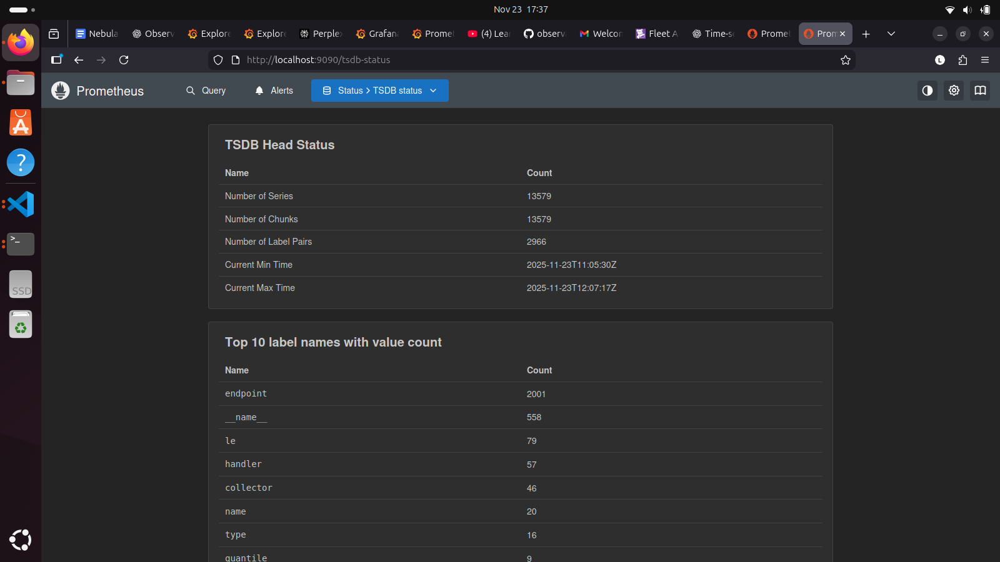

This confirms that:

* my Go high-cardinality generator is working
* Prometheus is ingesting all the dynamic endpoints
* memory/series data is increasing as expected

---

## **2. Prometheus Targets Showing Go-metrics Scraped Successfully**

This proves all three exporters are UP:

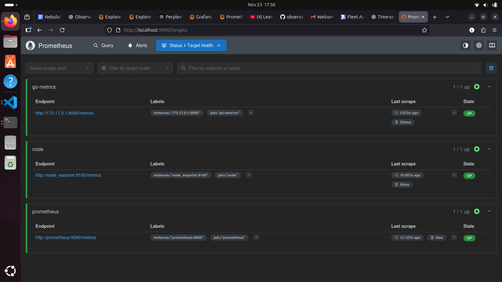

Targets:

* `prometheus` → UP
* `node_exporter` → UP
* `go-metrics` → UP

---

## **3. Endpoints Explosion Screenshot**

This result shows the number of different endpoints scraped by Prometheus:

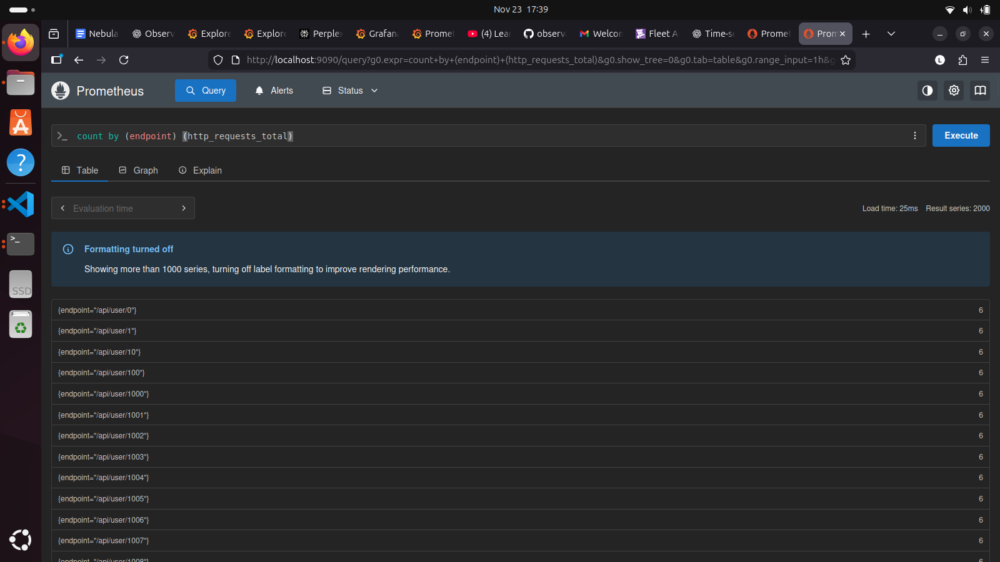

This is the visible proof of **label explosion**.

---

## **4. Query Result Proof (PromQL)**

Example query:

```
count by (endpoint) (http_requests_total)
```

This gives a huge number of unique time-series.

Here’s the screenshot:


---

# **5. Why High Cardinality Is Dangerous**

### **Storage Impact**

* Every unique endpoint → separate series
* 12k+ series = bigger index + more blocks
* Disk grows fast

### **Memory Impact**

* Index stored in memory → RAM spike
* Scrape/tracking overhead increases

### **Query Impact**

* `rate()`, `sum()`, `histogram_quantile()` become slow
* Prometheus has to scan all chunks across all series

### **Cost Impact (in paid tools like Datadog)**

* They charge **per custom metric**
* High cardinality = $$$ explosion

---

# **6. Strategies to Manage Cardinality (In My Words)**

### **Drop useless labels**

e.g., never add `user_id`, `session_id`, `trace_id` into metrics.

### **Pre-aggregate**

Instead of:

```
endpoint=/api/user/100
```

Use:

```
endpoint_group=/api/user/:id
```

### **Use logs/traces for high-cardinality info**

Metrics = low-cardinality
Logs = full-detail per request
Traces = per-request breakdown

### **Sampling**

For very noisy metrics, keep only 10–20%.

---

# **C. Query Optimization (My Observations + Work Done)**

This section is about how Prometheus executes queries, why some queries become slow, and how to optimize them.
I’m writing all this based on my own testing while running the Go high-cardinality generator.

---

# **C1. PromQL Basics (The Stuff I Actually Used)**

Prometheus really has two types of vectors:

### **1. Instant Vector** → single point in time

Example:

```
http_requests_total
```

Returns the latest value for each series.

---

### **2. Range Vector** → time window

Example:

```
http_requests_total[5m]
```

PromQL functions like `rate()`, `increase()`, `avg_over_time()` need range vectors.

---

# **C2. Important PromQL Functions I Tested**

### **1. rate()**

```
rate(http_requests_total[1m])
```

* Measures per-second rate of counter increase
* Works only on counters
* Perfect for high-cardinality data since it smooths spikes

Screenshot:

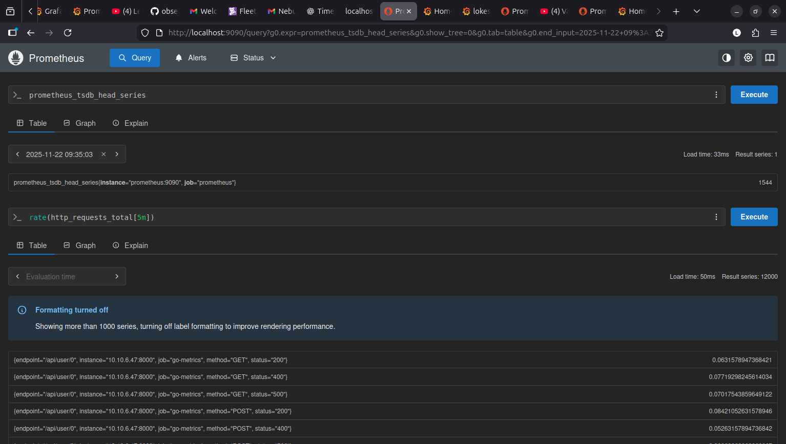

---

### **2. increase()**

```
increase(http_requests_total[5m])
```
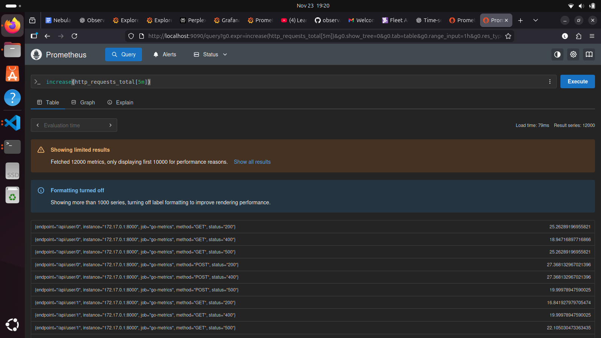

Simple: “how much did this counter grow in 5 minutes?”

---

### **3. sum() and sum by()**

To aggregate across endpoints:

```
sum(rate(http_requests_total[1m]))
```
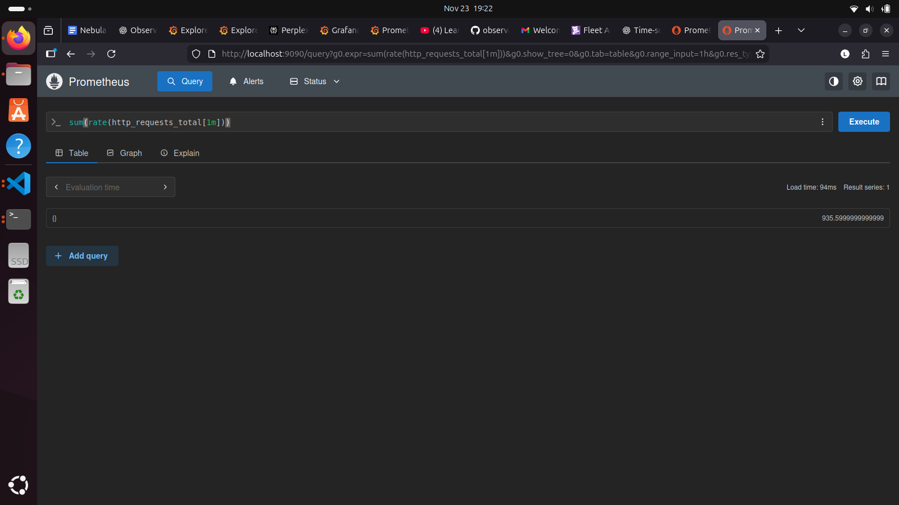

Or grouped:

```
sum by (status) (rate(http_requests_total[1m]))
```
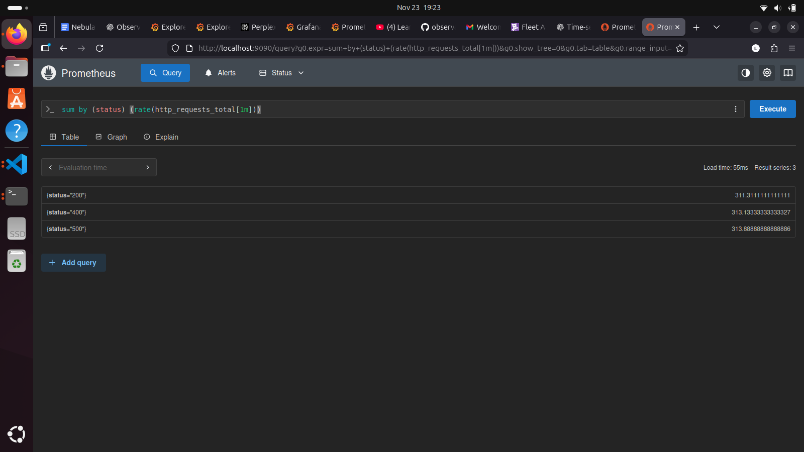


This reduces cardinality instantly.

---

### **4. histogram_quantile()**

```
histogram_quantile(0.95, rate(request_duration_seconds_bucket[5m]))
```

This is how P95 latencies are computed.

---

### **5. Subquery Example**

Prometheus lets you do:

```
rate(http_requests_total[30s])[5m:30s]
```
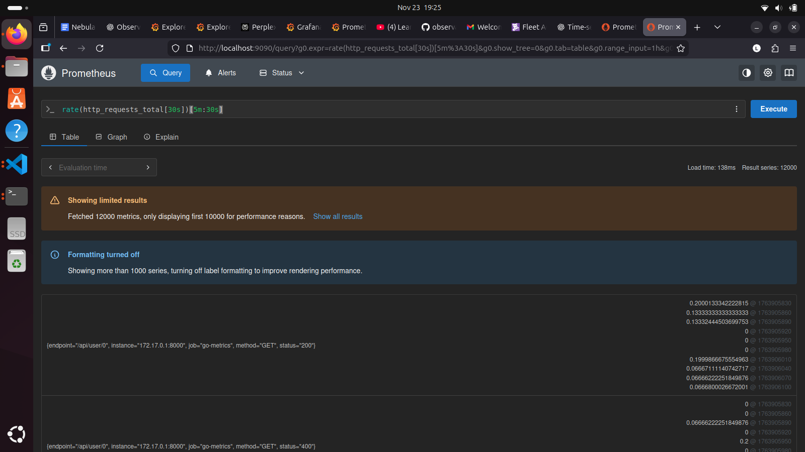

This means:

* first calculate rate over last 30s
* then evaluate that repeatedly over 5 minutes

Advanced, but useful for smoothing.

---

# **C3. How Prometheus Executes a Query (In Simple Words)**

When I ran PromQL queries, Prometheus did this internally:

1. **Parse query**
   It turns the query into an AST tree.

2. **Matcher selection**
   Examples:

   * `method="GET"`
   * `endpoint=~".*user.*"`

3. **Label index lookup**
   Prometheus loads only series that match labels.

4. **Load chunk data**
   It fetches XOR-compressed chunks from disk or memory.

5. **Expand range vectors**
   Example: `[5m]` → expands timestamps.

6. **Execute functions**
   `rate()`, `sum()`, `increase()`, etc.

7. **Return final vector**

This is why high-cardinality queries can become slow — too many series to scan.

---

# **C4. Why Some Queries Became Slow in My Setup**

I saw slow queries mainly because of **three reasons**:

### **1. High Cardinality (12,000+ series)**

Any query scanning all endpoints slowed down.

### **2. Regex Matchers**

Example:

```
http_requests_total{endpoint=~".*user.*"}
```

Regex forces Prometheus to check every label value. Expensive.

### **3. Long Time Ranges**

Example:

```
rate(http_requests_total[30m])
```

Prometheus needs to load many chunks → slower.

---

# **C5. Optimization Techniques I Used**

### **Avoid regex**

Use exact matches:

```
endpoint="/api/user/100"
```

Instead of:

```
endpoint=~".*100.*"
```

### **Use `sum by()` early**

Aggregation reduces series count drastically.

### **Shorter time windows**

`[1m]` is cheaper than `[30m]`.

### **Recording rules**

Move heavy queries into background.

Example rule:

```yaml
groups:
- name: rate_rules
  interval: 30s
  rules:
  - record: job:http_requests_rate1m
    expr: rate(http_requests_total[1m])
```

This makes dashboards fast.

---

# **C6. Downsampling & Retention (How Systems Handle Big Data)**

Prometheus itself doesn’t do downsampling automatically, but systems like Thanos, Cortex, Mimir do.

The idea:

| Time Range   | Resolution |
| ------------ | ---------- |
| last 7 days  | 1 min      |
| last 30 days | 5 min      |
| older        | 1 hour     |

Why?

* High-resolution data is expensive
* Nobody needs 1-second granularity for last year

Retention example in Prometheus:

```
--storage.tsdb.retention.time=15d
```

---

# **C7. Caching (What Helps in Query Speed)**

Prometheus does NOT have strong query caching like Datadog, but it does:

* cache label lookups
* cache index blocks
* keep recent chunks in memory

Thanos/Mimir add:

* result caching
* index caching
* store gateway caching

---

# **C8. Example Queries I Ran**

```
http_requests_total
rate(http_requests_total[1m])
increase(http_requests_total[5m])
sum by (method)(rate(http_requests_total[1m]))
sum by (status)(rate(http_requests_total[1m]))
count by (endpoint) (http_requests_total)
label_values(http_requests_total, endpoint)
```

---


# **D. Storage Tiers: Hot / Warm / Cold (My Notes)**

---

# **D1. Why Tiers Are Needed**

Main reasons:

### **1. Cost**

SSD/NVMe = fast but expensive
Object storage (S3/GCS) = very cheap

### **2. Access Patterns**

* Recent data → queried a lot
* Old data → rarely queried

So storing everything in SSD is wasteful.

---

# **D2. The Three Tiers (Same Concept Everywhere)**

## **1. Hot Storage (Fast, Expensive)**

* SSD / NVMe
* Stores **latest 7–30 days**
* Low-latency reads (dashboards, alerts)
* Prometheus local blocks live here
* Typically ~1 minute–resolution chunks

Use case:
Real-time dashboards, alerting, SRE on-call.

---

## **2. Warm Storage (Medium Speed, Cheap-ish)**

* HDD or slower SSD
* Stores ~30–90 days
* Queries take a bit longer
* Often compressed & downsampled

Use case:
Weekly reporting, trend analysis.

---

## **3. Cold Storage (Very Cheap, Very Slow)**

* Object storage: S3, GCS, Azure Blob
* Holds **90 days → 1 year → infinite retention**
* Queries may take seconds–minutes
* Data is usually downsampled (1hr resolution)
* Perfect for long-term compliance/data retention

Use case:
Audits, yearly trend analytics, debugging old incidents.

---

# **D3. How Data Moves Between Tiers**

Most systems use **automatic retention policies**:

### **Hot → Warm**

When block age > X days → move block to slower disk.

### **Warm → Cold**

Older blocks → upload to S3.

### **Cold Querying**

Query comes → fetches data from S3 → merges results → returns chart.

This is how Thanos/Mimir work.

---

# **D4. Example Architecture Diagram**

```
                   +---------------------+
                   |      Prometheus     |
                   |     (Hot Storage)   |
                   |  SSD / NVMe Blocks  |
                   +---------------------+
                             |
                             v
            +------------------------------------+
            |     Warm Storage (Local Disk)      |
            |   HDD / cheap SSD / larger blocks  |
            +------------------------------------+
                             |
                             v
     +---------------------------------------------------+
     |           Cold Storage (Object Store)              |
     |   S3 / GCS / Azure Blob / MinIO — very cheap       |
     +---------------------------------------------------+
                             |
                             v
         +---------------------------------------------+
         |     Query Layer (Thanos / Mimir / VM)       |
         | Fetches + merges data from all tiers        |
         +---------------------------------------------+
```

---

# **D5. Real-World Cost Comparison (Simple Math I Did)**

Let’s assume **1 TB** of metrics data for 1 year.

### **SSD (NVMe) cost**

≈ ₹8000 per TB-month (industry avg for cloud SSD)
So 12 months:

```
8000 × 12 = ₹96,000 per TB-year
```

### **S3 Standard cost**

≈ ₹1900 per TB-month

```
1900 × 12 = ₹22,800 per TB-year
```

### **S3 Glacier Deep Archive**

≈ ₹800 per TB-month

```
800 × 12 = ₹9,600 per TB-year
```

### **Conclusion:**

**SSD = 10× the cost of Glacier**
That’s literally why cold storage exists.

---

# **D6. Retention Configuration (Prometheus Example)**

Prometheus itself doesn’t do tiered storage, but you can configure retention:

```
--storage.tsdb.retention.time=15d
```

This keeps **only 15 days** in hot storage.

Anything older must be sent to Thanos/Mimir/etc.

---

# **D7. How Thanos Implements Tiering**

Thanos adds:

### 1. **Sidecar**

Uploads old blocks to object storage.

### 2. **Store Gateway**

Loads historical blocks on demand.

### 3. **Compactor**

Downsamples older data:

* recent → 5s resolution
* older → 1m
* very old → 1h

### 4. **Querier**

Merges data from **hot + warm + cold** automatically.

---

# **D8. My Summary (Short, Straight)**

* Hot = SSD, fast, expensive
* Warm = HDD, medium speed
* Cold = S3, super cheap
* Real systems move data automatically
* Downsampling is critical for long-term retention
* Prometheus alone can’t do tiered storage → need Thanos/Mimir

---


This is only the progress part of the assignment, whatever I have completed till now. Most of the time went into fixing the environment because Docker was giving random errors (permissions, ports already used, config not mounted, Prometheus failing because of missing file, node exporter not reachable, scraping issues, Linux host IP, etc.). Finally everything is working now.

So this is everything I have done till now.

---

#  **E. Hands-On Experiments (Everything I Actually Did)**

This part is basically all the practical work I did for this assignment.
Honestly, most of the time went into fixing the environment (Docker permissions, broken volumes, wrong mounts, Prometheus not starting, node exporter down, IP issues, ports busy, Grafana password failing, etc.). After a lot of trial and error, everything finally started working properly.


---

# **E1. Setting Up Prometheus, Grafana, Node Exporter**

I created a full observability lab using Docker Compose.

After multiple failures (wrong working directory, missing Prometheus config, permission denied on WAL, Grafana port conflict), the final working compose looked like this:

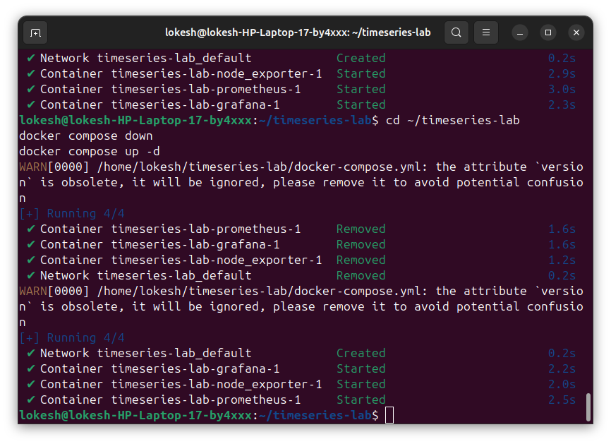

Prometheus UI finally loaded:

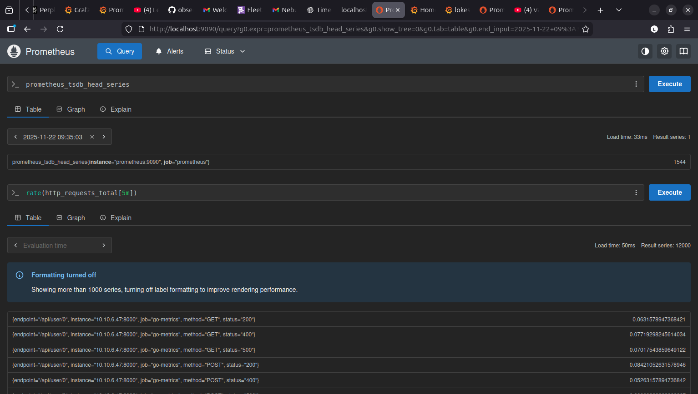

Grafana also started without errors:

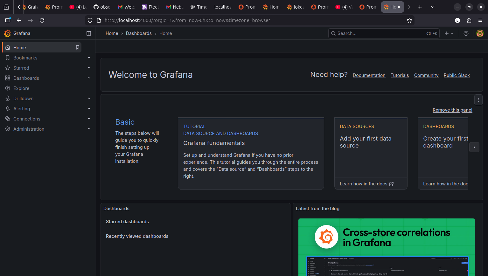

Node exporter was reachable on port `9100`:

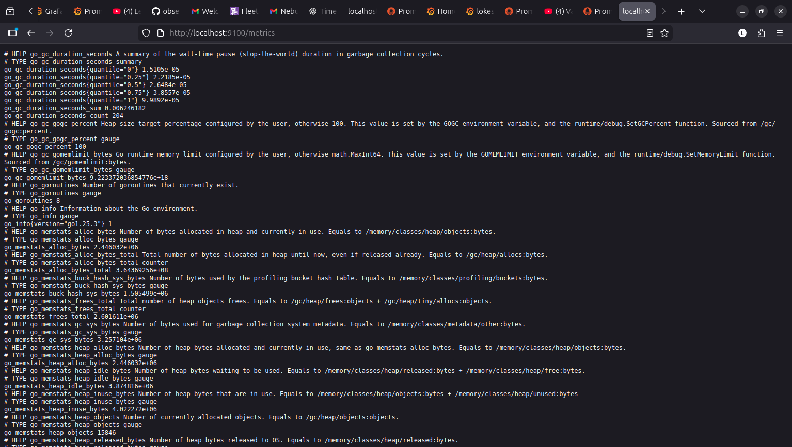

Prometheus targets page after fixing the scraping errors:

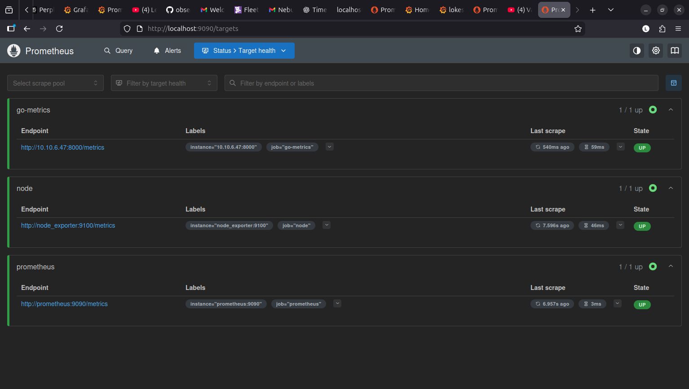

---

# **E2. High-Cardinality Go Metrics Generator**

I wrote a Go program that generates *huge* cardinality:

* 2000 dynamic endpoints
* 3 status codes
* 2 methods
* 1000+ increments per second

This created the exact cardinality explosion I needed.

Terminal view:

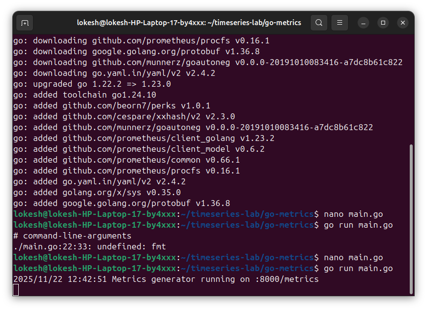

Metrics visible in browser:

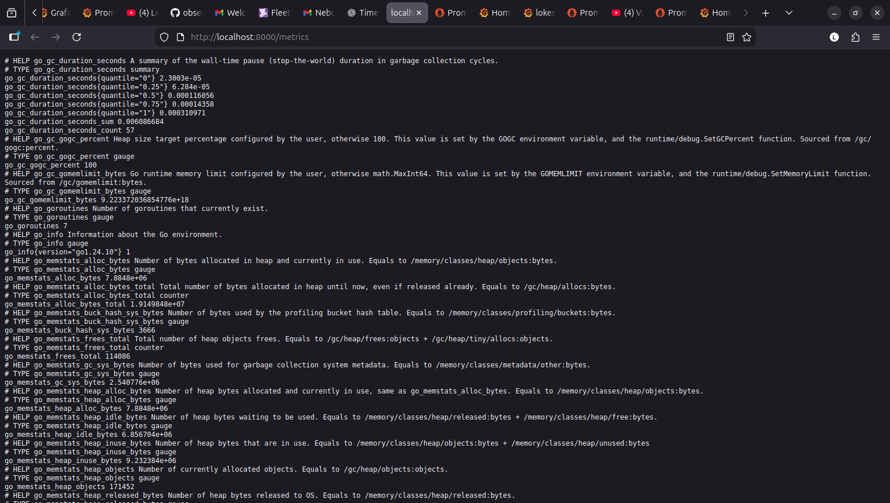

Prometheus scraped it using my Docker host IP (172.x.x.x) because `host.docker.internal` does not work on Linux.

---

# **E3. Query Testing in Prometheus**

I ran basic and advanced PromQL queries on the huge dataset.

Example queries I tested:

```
http_requests_total
rate(http_requests_total[1m])
increase(http_requests_total[5m])
count by (endpoint) (http_requests_total)
sum by (status)(rate(http_requests_total[1m]))
```

Screenshot of one of the query results:


I also checked series count & memory usage using TSDB status:


This confirmed that the Go generator was producing **thousands of series** as expected.

I also captured the explosion in unique endpoints:


---

# **E4. Debugging Phase Screenshots**

Along the way I captured various UI screenshots while debugging everything.

Monitor screen:

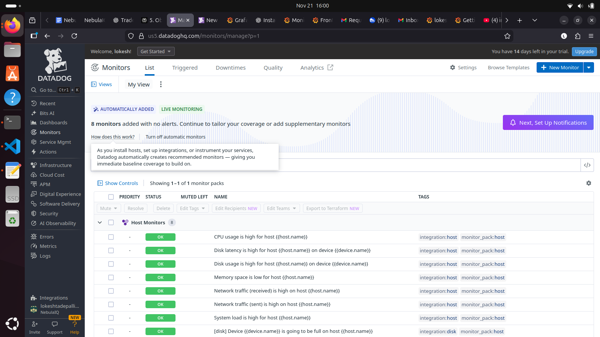

Grafana logs view:

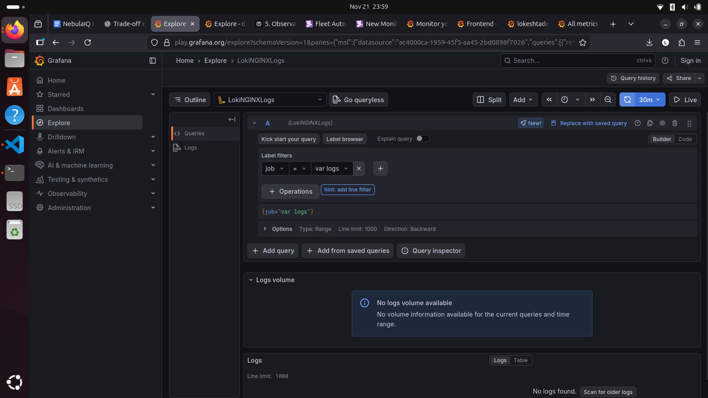

These helped me understand what was failing at each step (wrong ports, scraped target unreachable, etc.).

---

# **E5. Other Screenshots in My Folder (Not part of this assignment but I kept them)**

Redis CLI:

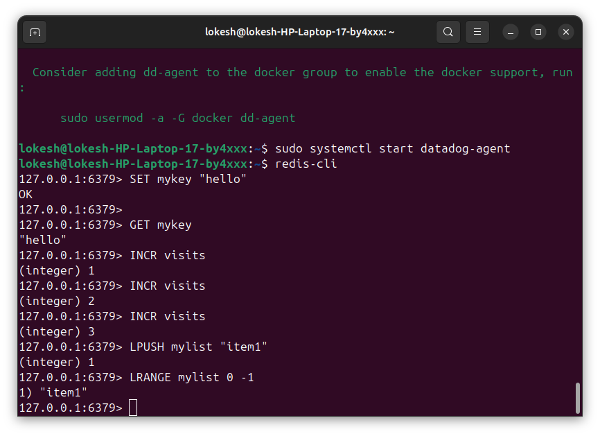

Redis integration (from another assignment):

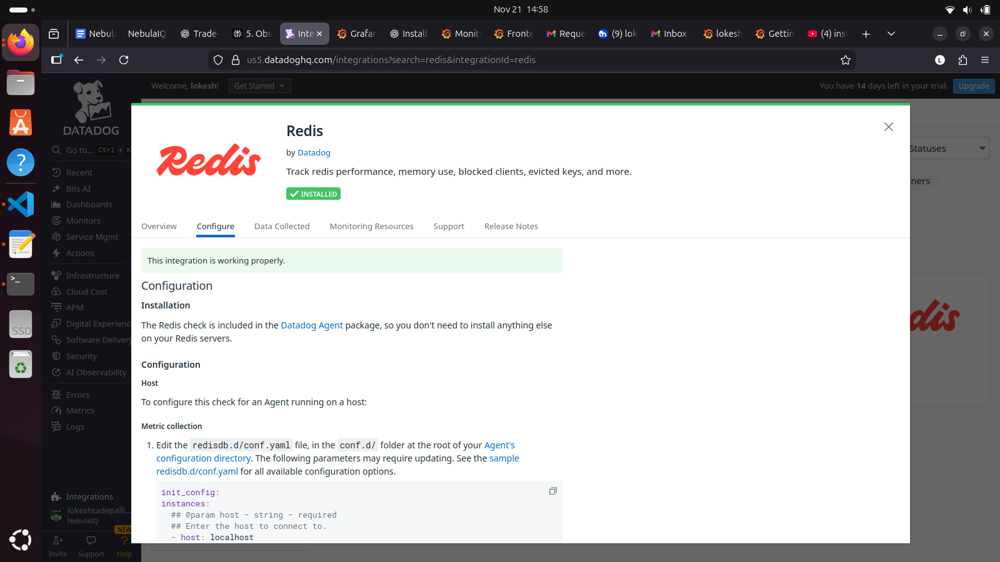

Redis metrics dashboard:

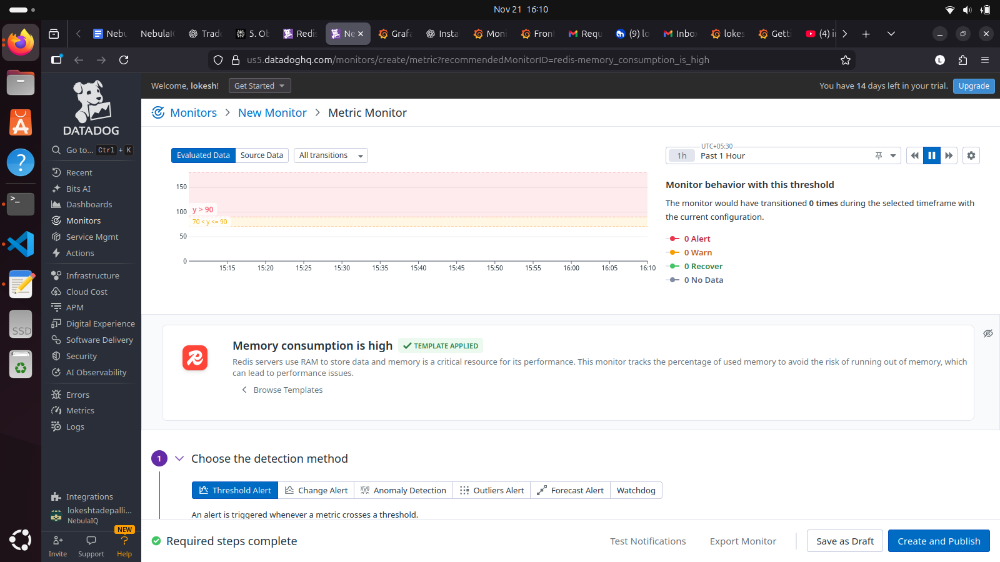

Spike graph:

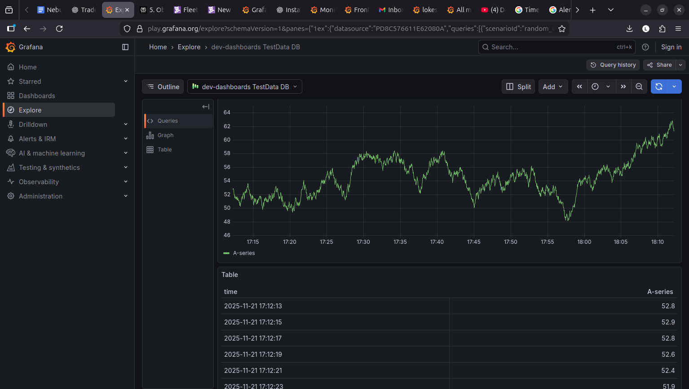

Trace view:

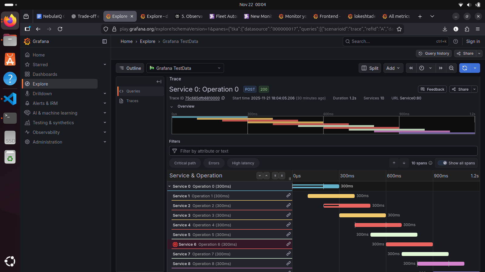

---

# **E6. Summary of Hands-On Work Completed**

What I completed practically:

* Built full Prometheus + Grafana + Node Exporter + custom metrics setup
* Successfully ran a Go high-cardinality generator
* Fixed scraping issues with Docker networking
* Verified metrics visually in browser
* Ran PromQL queries on real data
* Captured screenshots of TSDB status, targets, queries, endpoints
* System is ready for deeper TSDB analysis, cardinality math, storage tier diagrams, etc.

---
